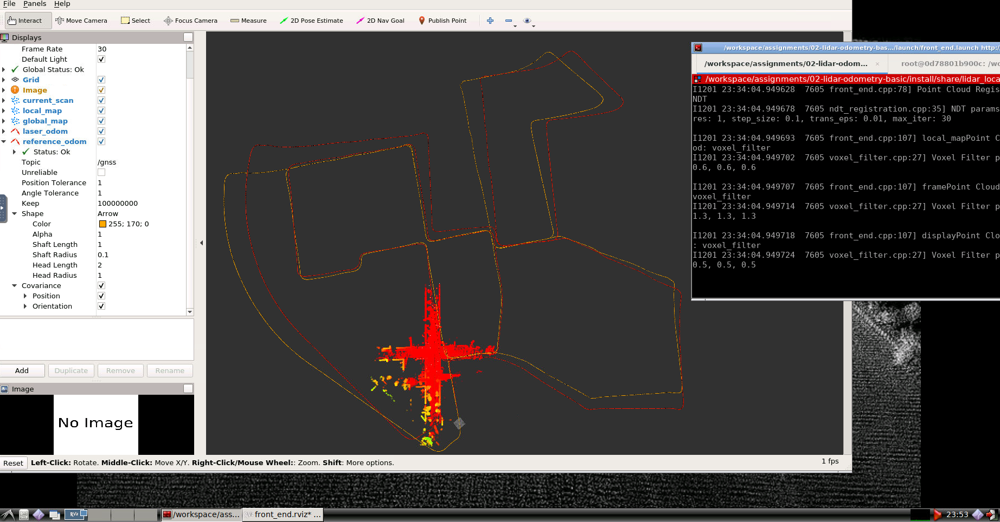
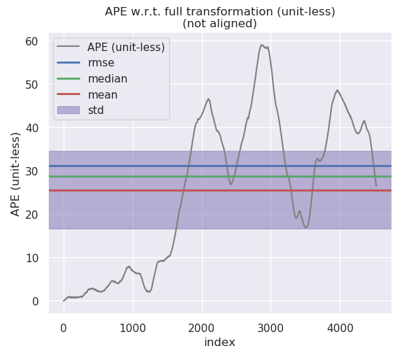
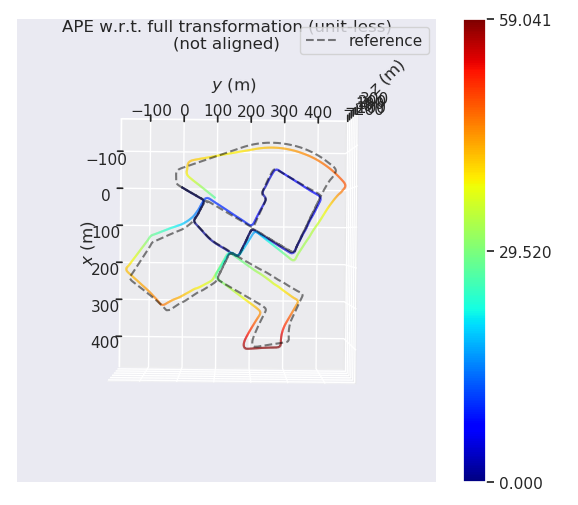
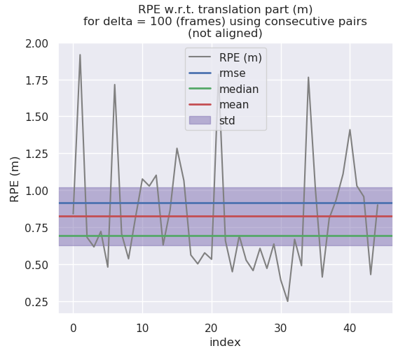
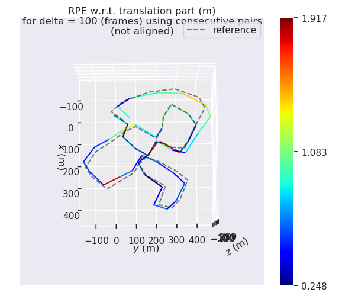
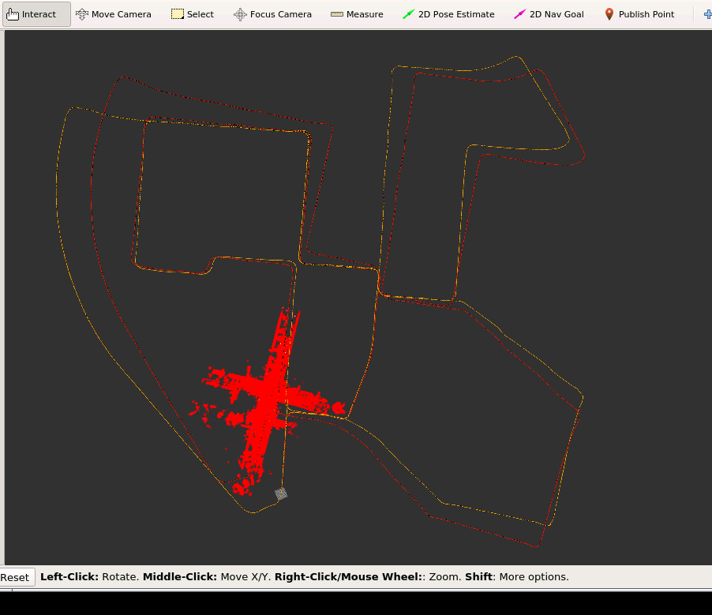
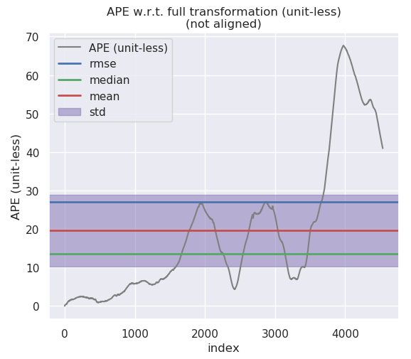
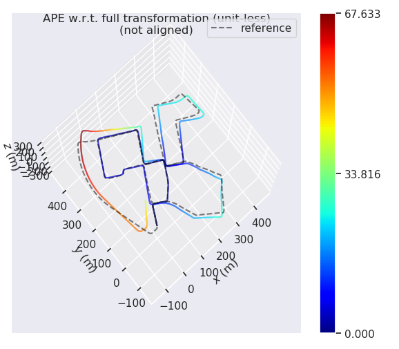
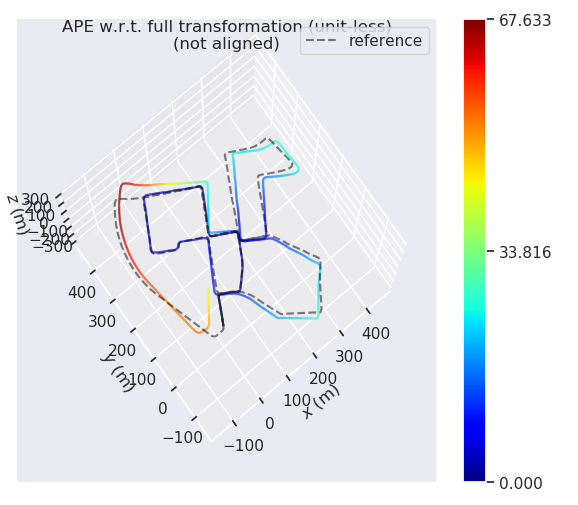
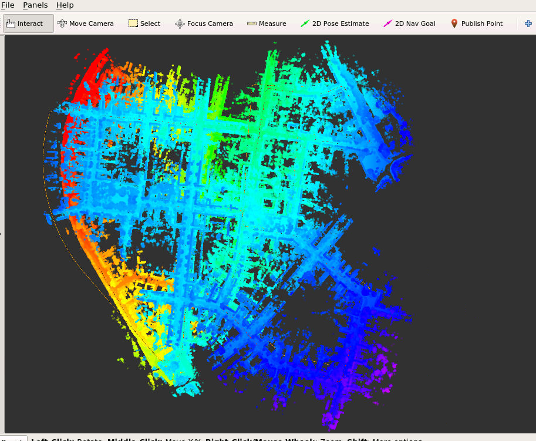

NDT:



NDT_APE
<table>
  <td>  </td>
  <td>  </td>
</table>

NDT_RPE
<table>
  <td>  </td>
  <td>  </td>
</table>

ICP_SVD:
GetCorrespondence method:

```
size_t ICPSVDRegistration::GetCorrespondence(
    const CloudData::CLOUD_PTR &input_source, 
    std::vector<Eigen::Vector3f> &xs,
    std::vector<Eigen::Vector3f> &ys
) {
    const float MAX_CORR_DIST_SQR = max_corr_dist_ * max_corr_dist_;

    size_t num_corr = 0;

    pcl::PointXYZ curr_point_input, curr_point_target;

	std::vector<float> dist(1);
	std::vector<int> closest_pt(1);
	// // cout << “Starting Finding Correspondence” << endl;
	for (int i = 0; i < input_source->size(); i++ )
	{
		curr_point_input = input_source->points[i];
        input_target_kdtree_->nearestKSearch (curr_point_input, 1, closest_pt, dist);
        if (dist[0] < MAX_CORR_DIST_SQR)
        {
            num_corr++;
            ys.push_back(Eigen::Vector3f({curr_point_input.x, curr_point_input.y, curr_point_input.z}));
            curr_point_target = input_target_->points[closest_pt[0]];
            xs.push_back(Eigen::Vector3f({curr_point_target.x, curr_point_target.y, curr_point_target.z}));
        }
	}
	// cout << “Finished Finding Correspondence” << endl;

    return num_corr;
}
```

GetTransform Method:
```
void ICPSVDRegistration::GetTransform(
    const std::vector<Eigen::Vector3f> &xs,
    const std::vector<Eigen::Vector3f> &ys,
    Eigen::Matrix4f &transformation_
) {
    const size_t N = xs.size();

    // TODO: find centroids of mu_x and mu_y:
    Eigen::Vector3f mu_x, mu_y;
    mu_x.setZero(); 
    mu_y.setZero();
    for (unsigned int i = 0; i < xs.size(); i++)
    {
        mu_x+=xs[i];
        mu_y+=ys[i];
    }
    mu_x /= xs.size();
    mu_y /= ys.size();

    // TODO: build H:
    Eigen::Matrix3f H;
    H.setZero();
    for (unsigned int i = 0; i < xs.size(); i++)
        H += (ys[i] - mu_y) * (xs[i] - mu_x).transpose();

    // TODO: solve R:
    Eigen::JacobiSVD<Eigen::Matrix3f> svd(H, Eigen::ComputeFullU | Eigen::ComputeFullV); 
    Eigen::Matrix3f U = svd.matrixU();
    Eigen::Matrix3f V = svd.matrixV();
    Eigen::Matrix3f R = V*(U.transpose());

    // TODO: solve t:
    Eigen::Vector3f t;
    t.setZero();
    t = mu_x - R*mu_y;

    // TODO: set output:
    transformation_.setIdentity();
    transformation_.topLeftCorner(3,3) = R;
    transformation_.block(0,3,3,1) = t;
    return;
}
```

ScanMatch Method
```
bool ICPSVDRegistration::ScanMatch(
    const CloudData::CLOUD_PTR& input_source, 
    const Eigen::Matrix4f& predict_pose, 
    CloudData::CLOUD_PTR& result_cloud_ptr,
    Eigen::Matrix4f& result_pose
) {
    input_source_ = input_source;

    // pre-process input source:
    CloudData::CLOUD_PTR transformed_input_source(new CloudData::CLOUD());
    pcl::transformPointCloud(*input_source_, *transformed_input_source, predict_pose);

    // init estimation:
    transformation_.setIdentity();
    Eigen::Matrix4f transformation_update;
    transformation_update.setIdentity();
    
    //
    // TODO: first option -- implement all computing logic on your own
    //
    // do estimation:
    int curr_iter = 0;
    CloudData::CLOUD_PTR curr_source(new CloudData::CLOUD());
    while (curr_iter < max_iter_) {
        // TODO: apply current estimation:
        pcl::transformPointCloud(*transformed_input_source, *curr_source, transformation_);
        // TODO: get correspondence:
        std::vector<Eigen::Vector3f> source_match, target_match;
        int num_corr_ = GetCorrespondence(curr_source, source_match, target_match);

        // TODO: do not have enough correspondence -- break:
        if (num_corr_ < 20)
        {
            LOG(INFO) << "SVD_ICP FAILED, NOT ENOUGH CORRESPONDENSES FOR ICP" << std::endl;
            LOG(INFO) << "NUM OF CORRESPONDENCE: " << num_corr_ << std::endl;
            return false;
        }

        // TODO: update current transform:
        GetTransform(source_match, target_match, transformation_update);

        // TODO: whether the transformation update is significant:
        if (!IsSignificant(transformation_update, trans_eps_))
        {
            LOG(INFO) << "Update is not significant: " << num_corr_ << std::endl;
            break;
        }
        // TODO: update transformation:
        transformation_ = transformation_update * transformation_;

        ++curr_iter;
    }
    Eigen::Matrix3f  R_mat(transformation_.block<3,3>(0,0));
    Eigen::JacobiSVD<Eigen::Matrix3f> svd(R_mat, Eigen::ComputeFullU | Eigen::ComputeFullV); 
    Eigen::Matrix3f R_mat_normalized = svd.matrixU() * svd.matrixV().transpose();
    transformation_.block<3,3>(0,0) = R_mat_normalized;
    
    // set output:
    result_pose = transformation_ * predict_pose;
    pcl::transformPointCloud(*input_source_, *result_cloud_ptr, result_pose);
    
    return true;
}
```

ICP_SVD:



ICP_SVD_APE
<table>
  <td>  </td>
  <td>  </td>
</table>

ICP_SVD_RPE
<table>
  <td>  </td>
  <td>  </td>
</table>

ICP_SVD_FULLMAP


