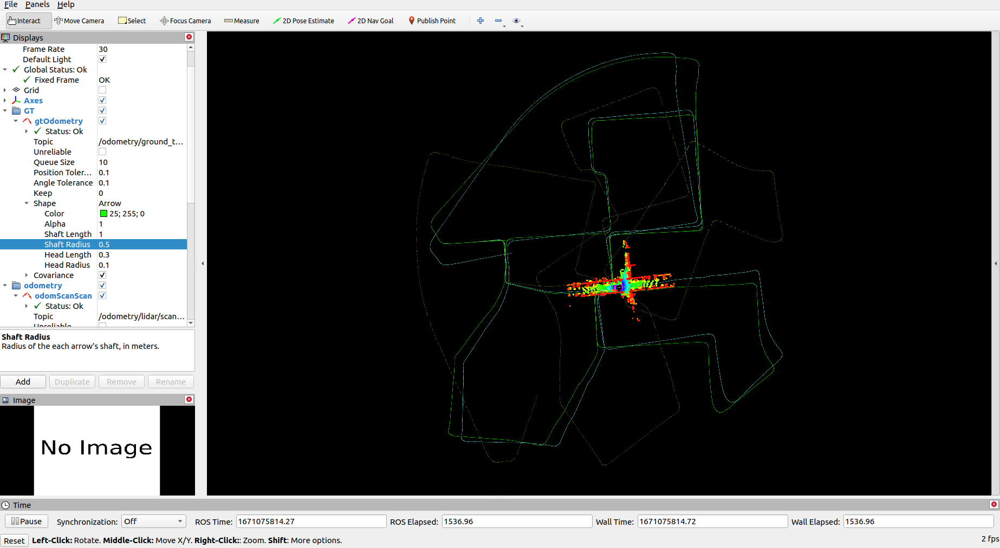
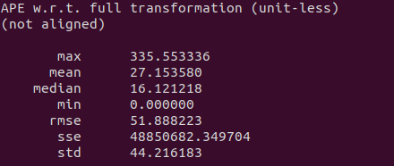

A-Loam:


A-Loam APE:


<table>
  <td>  </td>
  <td>  </td>
</table>

A-Loam RPE


<table>
  <td>  </td>
  <td>  </td>
</table>

F-Loam:




F-Loam APE:


<table>
  <td>  </td>
  <td>  </td>
</table>

F-Loam RPE

<table>
  <td>  </td>
  <td>  </td>
</table>

可以看出用解析求导和自动求导效果基本相当。但是不知道为什么跑解析求导时scan_to_map的线程跑的特别慢。还有一个疑问就是不是特别清楚loam的map_to_scan的过程，和回环检测的区别是在哪里呢？回环应该也是用了类似的概念，只是缺少一个后端位姿图优化吗？
可以看到优化的速度从aloam的6.3ms降到了floam的2.5ms。但是由于实现的框架不同，整体floam的速度反而比aloam慢一些。应该是一些代码优化的问题。

跑Aloam可以用

```
roslaunch lidar_locaization aloam.launch
```
跑Floam可以用

```
roslaunch lidar_locaization floam.launch
```

直接用了Floam的SE3 LocalParameterization:

```
class PoseSE3Parameterization : public ceres::LocalParameterization {
public:
	// Quaternion and then translation
    PoseSE3Parameterization() {}
    virtual ~PoseSE3Parameterization() {}
    virtual bool Plus(const double* x, const double* delta, double* x_plus_delta) const
	{
		Eigen::Map<const Eigen::Vector3d> trans(x + 4);

		Eigen::Quaterniond delta_q;
		Eigen::Vector3d delta_t;
		getTransformFromSe3(Eigen::Map<const Eigen::Matrix<double,6,1>>(delta), delta_q, delta_t);
		Eigen::Map<const Eigen::Quaterniond> quater(x);
		Eigen::Map<Eigen::Quaterniond> quater_plus(x_plus_delta);
		Eigen::Map<Eigen::Vector3d> trans_plus(x_plus_delta + 4);

		quater_plus = delta_q * quater;
		trans_plus = delta_q * trans + delta_t;

    	return true;
	}
    virtual bool ComputeJacobian(const double* x, double* jacobian) const
	{
		Eigen::Map<Eigen::Matrix<double, 7, 6, Eigen::RowMajor>> j(jacobian);
		(j.topRows(6)).setIdentity();
		(j.bottomRows(1)).setZero();

		return true;
	}
    virtual int GlobalSize() const { return 7; }
    virtual int LocalSize() const { return 6; }
};
```

将FloamRegistration从q，t改成了用一个parameter：pose:

```
struct {
      // double q[4] = {0.0, 0.0, 0.0, 1.0};
      // double t[3] = {0.0, 0.0, 0.0};
      double pose[7] = {0.0, 0.0, 0.0, 1.0, 0.0, 0.0, 0.0};
    } param_;
```

Edge Factor Definition:

```
class LidarEdgeFactor:  public   ceres::SizedCostFunction<1, 7> // Size 1 residue, Input block 4 (quaternion), and 3 (translation) 
{
	public:
		Eigen::Vector3d cp, lpa, lpb;
		double s;
		LidarEdgeFactor(Eigen::Vector3d curr_point_, Eigen::Vector3d last_point_a_,
						Eigen::Vector3d last_point_b_, double s_)
			: cp(curr_point_), lpa(last_point_a_), lpb(last_point_b_), s(s_) {}

	virtual bool Evaluate(double const* const* parameters,
                          double* residual,
                          double** jacobians) const
	{
		Eigen::Map<const  Eigen::Quaterniond>   q_last_curr(parameters[0]);               //   存放 w  x y z 
        Eigen::Map<const  Eigen::Vector3d>      t_last_curr(parameters[0] + 4);
		// Eigen::Quaternion<T> q_last_curr{q[3], q[0], q[1], q[2]};
		// Eigen::Quaternion<T> q_identity{T(1), T(0), T(0), T(0)};
		// q_last_curr = q_identity.slerp(T(s), q_last_curr);
		// Eigen::Matrix<T, 3, 1> t_last_curr{T(s) * t[0], T(s) * t[1], T(s) * t[2]};

		Eigen::Vector3d lp;
		lp = q_last_curr * cp + t_last_curr;

		Eigen::Vector3d nu = (lp - lpa).cross(lp - lpb);
		Eigen::Vector3d de = lpa - lpb;

		residual[0] = nu.norm() / de.norm();

		if (jacobians != nullptr && jacobians[0] != nullptr) 
		{
			Eigen::Matrix3d skew_lp = skew(lp);
            Eigen::Matrix<double, 3, 6> dp_by_se3;
            dp_by_se3.block<3,3>(0,0) = -skew_lp;
            (dp_by_se3.block<3,3>(0, 3)).setIdentity();
            Eigen::Map<Eigen::Matrix<double, 1, 7, Eigen::RowMajor> > J_se3(jacobians[0]);
            J_se3.setZero();
            Eigen::Matrix3d skew_de = skew(de);
            J_se3.block<1,6>(0,0) = - nu.transpose() / nu.norm() * skew_de * dp_by_se3/de.norm();
		}
		return true;
	}
};
```

Lidar Plane Factor:

```
class LidarPlaneFactor : public   ceres::SizedCostFunction<1, 7> 
{
	public:
		LidarPlaneFactor(Eigen::Vector3d curr_point_, Eigen::Vector3d last_point_j_,
						Eigen::Vector3d last_point_l_, Eigen::Vector3d last_point_m_, double s_)
			: cp(curr_point_), lpj(last_point_j_), lpl(last_point_l_),
			lpm(last_point_m_), s(s_)
		{
			ljm_norm = (lpj - lpl).cross(lpj - lpm);
			ljm_norm.normalize();
		}

	virtual bool Evaluate(double const* const* parameters,
                          double* residual,
                          double** jacobians) const
	{
		Eigen::Map<const  Eigen::Quaterniond>   q_last_curr(parameters[0]);             
		Eigen::Map<const  Eigen::Vector3d>      t_last_curr(parameters[0] + 4);

		Eigen::Vector3d lp;
		lp = q_last_curr * cp + t_last_curr;

		residual[0] = (lp - lpj).dot(ljm_norm);

        if (jacobians != nullptr && jacobians[0] != nullptr) 
		{
			Eigen::Matrix3d skew_lp = skew(lp);
            Eigen::Matrix<double, 3, 6> dp_by_se3;
            dp_by_se3.block<3,3>(0,0) = -skew_lp;
            (dp_by_se3.block<3,3>(0, 3)).setIdentity();
            Eigen::Map<Eigen::Matrix<double, 1, 7, Eigen::RowMajor> > J_se3(jacobians[0]);
            J_se3.setZero();
            J_se3.block<1,6>(0,0) = ljm_norm.transpose() * dp_by_se3;
		}
		return true;
	}

	Eigen::Vector3d cp, lpj, lpl, lpm;
	Eigen::Vector3d ljm_norm;
	double s;
};
```

Lidar Plane Normal Factor （还是用的自动求导，但是改变了parameter的形式

```
struct LidarPlaneNormFactor
{

	LidarPlaneNormFactor(Eigen::Vector3d curr_point_, Eigen::Vector3d plane_unit_norm_,
						 double negative_OA_dot_norm_) : curr_point(curr_point_), plane_unit_norm(plane_unit_norm_),
														 negative_OA_dot_norm(negative_OA_dot_norm_) {}

	template <typename T>
	bool operator()(const T *pose, T *residual) const
	{
		Eigen::Quaternion<T> q_w_curr{pose[3], pose[0], pose[1], pose[2]};
		Eigen::Matrix<T, 3, 1> t_w_curr{pose[4], pose[5], pose[6]};
		Eigen::Matrix<T, 3, 1> cp{T(curr_point.x()), T(curr_point.y()), T(curr_point.z())};
		Eigen::Matrix<T, 3, 1> point_w;
		point_w = q_w_curr * cp + t_w_curr;

		Eigen::Matrix<T, 3, 1> norm(T(plane_unit_norm.x()), T(plane_unit_norm.y()), T(plane_unit_norm.z()));
		residual[0] = norm.dot(point_w) + T(negative_OA_dot_norm);
		return true;
	}

	static ceres::CostFunction *Create(const Eigen::Vector3d curr_point_, const Eigen::Vector3d plane_unit_norm_,
									   const double negative_OA_dot_norm_)
	{
		return (new ceres::AutoDiffCostFunction<
				LidarPlaneNormFactor, 1, 7>(
			new LidarPlaneNormFactor(curr_point_, plane_unit_norm_, negative_OA_dot_norm_)));
	}

	Eigen::Vector3d curr_point;
	Eigen::Vector3d plane_unit_norm;
	double negative_OA_dot_norm;
};
```

Jacobian的推导：
HW31024_1.jpg


