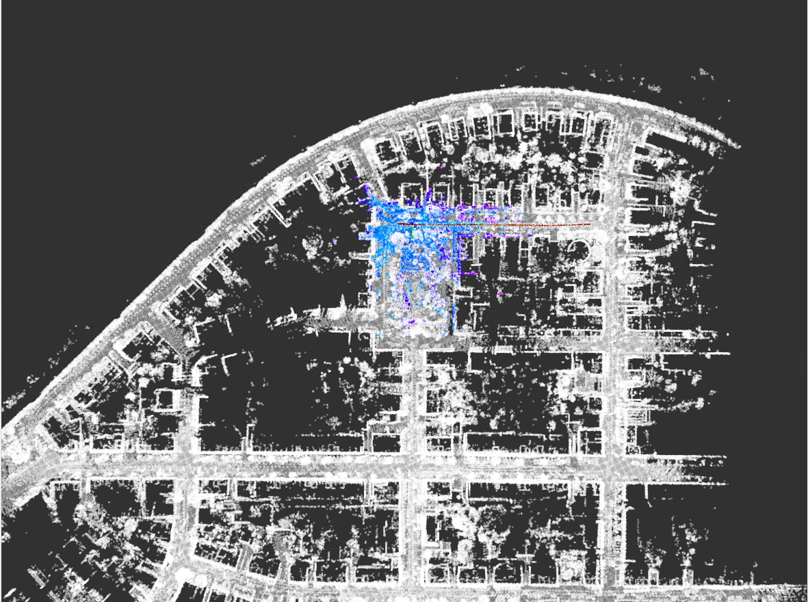
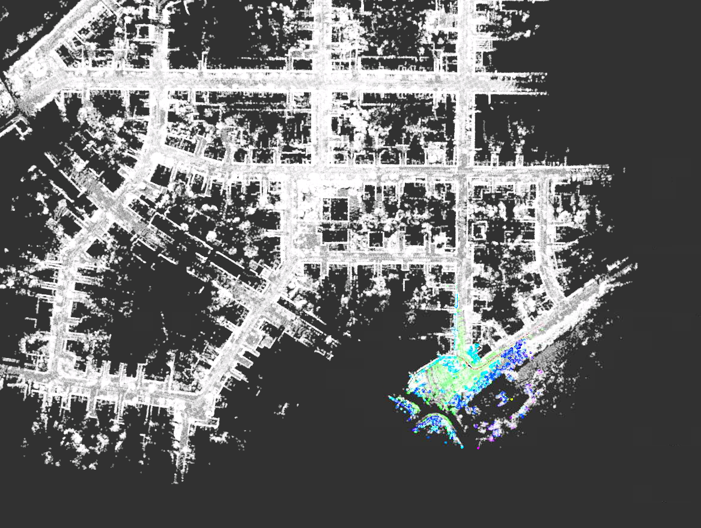

建图结果：
<table>
  <td>  </td>
  <td>  </td>
</table>
红色的路线是里程计所以有一点偏离。

修改UpdateMatching():

```
bool MatchingFlow::UpdateMatching() {
  if (!matching_ptr_->HasInited()) {
    //
    // TODO: implement global initialization here
    //
    // Hints: You can use SetGNSSPose & SetScanContextPose from matching.hpp
    //

    // naive implementation:

    // Eigen::Matrix4f init_pose = Eigen::Matrix4f::Identity();
    // matching_ptr_->SetInitPose(init_pose);


    if (init_strategy_ == 1)
    {
       matching_ptr_->SetScanContextPose(current_cloud_data_);
       matching_ptr_->SetInited();
       std::cout << "Initializing with Scan Context! " << std::endl;
    }
    else if (init_strategy_ == 2)
    {
        matching_ptr_->SetGNSSPose(current_gnss_data_.pose);
        matching_ptr_->SetInited();
        std::cout << "Initializing with GNSS! " << std::endl;
    }    
    else
    {
        LOG(ERROR) << "Initialization Strategy " << init_strategy_ << " NOT FOUND!";
        return false;
    }
  }
```

添加了config文件可以选择scanContext或者GNSS：

```
  std::string config_file_path = WORK_SPACE_PATH + "/config/matching/matching.yaml";
  YAML::Node config_node = YAML::LoadFile(config_file_path);
  init_strategy_ = config_node["init_strategy"].as<int>();
```

ScanContextInit 结果
<table>
  <td>  
  100 seconds in
  </td> 
  <td>  
  200 seconds in
  </td> 
</table>
<table>
  <td> 
  300 seconds in
  </td> 
  <td> 
  400 seconds in
  </td> 
</table>

GNSSInit 结果
<table>
  <td> 
  100 seconds in
  </td> 
  <td> 
  200 seconds in
  </td> 
</table>
<table>
  <td> 
  300 seconds in
  </td> 
  <td> 
  400 seconds in
  </td> 
</table>
