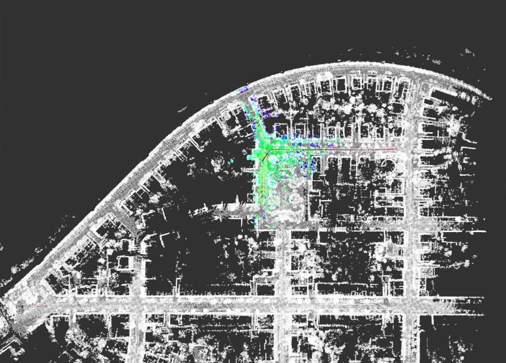
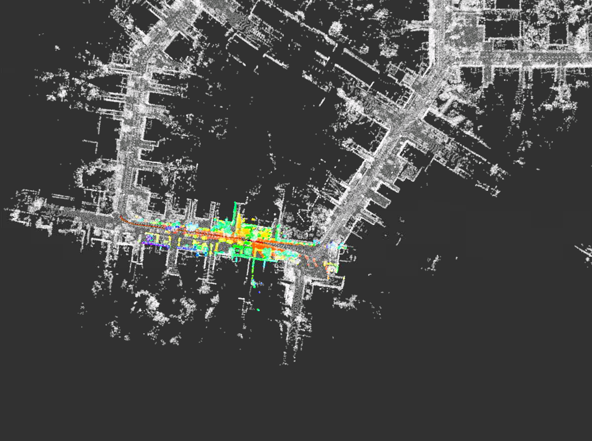

建图结果：
<table>
  <td>  </td>
  <td>  </td>
</table>
红色的路线是里程计所以有一点偏离。

修改UpdateMatching():

```
bool MatchingFlow::UpdateMatching() {
  if (!matching_ptr_->HasInited()) {
    //
    // TODO: implement global initialization here
    //
    // Hints: You can use SetGNSSPose & SetScanContextPose from matching.hpp
    //

    // naive implementation:

    // Eigen::Matrix4f init_pose = Eigen::Matrix4f::Identity();
    // matching_ptr_->SetInitPose(init_pose);


    if (init_strategy_ == 1)
    {
       matching_ptr_->SetScanContextPose(current_cloud_data_);
       matching_ptr_->SetInited();
       std::cout << "Initializing with Scan Context! " << std::endl;
    }
    else if (init_strategy_ == 2)
    {
        matching_ptr_->SetGNSSPose(current_gnss_data_.pose);
        matching_ptr_->SetInited();
        std::cout << "Initializing with GNSS! " << std::endl;
    }    
    else
    {
        LOG(ERROR) << "Initialization Strategy " << init_strategy_ << " NOT FOUND!";
        return false;
    }
  }
```

添加了config文件可以选择scanContext或者GNSS：

```
  std::string config_file_path = WORK_SPACE_PATH + "/config/matching/matching.yaml";
  YAML::Node config_node = YAML::LoadFile(config_file_path);
  init_strategy_ = config_node["init_strategy"].as<int>();


ScanContextInit 结果

```
bool Matching::SetScanContextPose(const CloudData& init_scan) {
    // get init pose proposal using scan context match:
    Eigen::Matrix4f init_pose =  Eigen::Matrix4f::Identity();

    if (
        !scan_context_manager_ptr_->DetectLoopClosure(init_scan, init_pose)
    ) {
        return false;
    }

    // set init pose:
    SetInitPose(init_pose);
    has_inited_ = true;
    
    return true;
}
```
这个函数使用激光雷达的数据用scan_context来找闭环，然后闭环的位姿来初始化定位。

<table>
  <td>  
  100 seconds in
  </td> 
  <td>  
  200 seconds in
  </td> 
</table>
<table>
  <td> 
  300 seconds in
  </td> 
  <td> 
  400 seconds in
  </td> 
</table>

GNSSInit 结果

```
bool Matching::SetGNSSPose(const Eigen::Matrix4f& gnss_pose) {
    static int gnss_cnt = 0;

    current_gnss_pose_ = gnss_pose;

    if ( gnss_cnt == 0 ) {
        SetInitPose(gnss_pose);
    } else if (gnss_cnt > 3) {
        has_inited_ = true;
    }

    gnss_cnt++;

    return true;
}
```
这个函数就是用gnss给的变换矩阵来初始化定位。由于gnss的位姿是global的，所以需要知道gnss现在的位姿相对于地图的坐标系的变换。在gnss_data.cpp中修改gnss原点的位姿。这个位姿为rosbag的第一个gnss数据

```
namespace lidar_localization {
void GNSSData::InitOriginPosition() {
    geo_converter.Reset(48.982545, 8.390366, 116.3821411);

    origin_longitude = 0.0;
    origin_latitude = 0.0;
    origin_altitude = 0.0;

    origin_position_inited = true;
}
```

<table>
  <td> 
  100 seconds in
  </td> 
  <td> 
  200 seconds in
  </td> 
</table>
<table>
  <td> 
  300 seconds in
  </td> 
  <td> 
  400 seconds in
  </td> 
</table>
