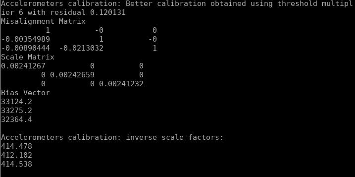

Jacobian的推导：


下三角需要修改的三个地方：

在MultiPosAccResidual中需要把上三角的三个值赋为0，把param的前三个值赋给下三角的三个值

```
CalibratedTriad_<_T2> calib_triad( 
      //
      // TODO: implement lower triad model here
      //
      // mis_yz, mis_zy, mis_zx:
      _T2(0), _T2(0), _T2(0),
      // mis_xz, mis_xy, mis_yx:
      params[0], params[1], params[2],
      //    s_x,    s_y,    s_z:
      params[3], params[4], params[5], 
      //    b_x,    b_y,    b_z: 
      params[6], params[7], params[8] 
    );
```

Calibrate时候取出下三角对应的 XZ，XY，YX

```
template <typename _T>
bool MultiPosCalibration_<_T>::calibrateAcc( 
  const std::vector< TriadData_<_T> >& acc_samples 
) {
    ...
    // acc_calib_params[0] = init_acc_calib_.misYZ();
    // acc_calib_params[1] = init_acc_calib_.misZY();
    // acc_calib_params[2] = init_acc_calib_.misZX();

    acc_calib_params[0] = init_acc_calib_.misXZ();
    acc_calib_params[1] = init_acc_calib_.misXY();
    acc_calib_params[2] = init_acc_calib_.misYX();
    ...
}
```

如第一部分一样，在校正完成之后，重建下三角模型的CalibratedTriad_：

```
acc_calib_ = CalibratedTriad_<_T>( 
    //
    // TODO: implement lower triad model here
    // 
    // min_cost_calib_params[0],
    // min_cost_calib_params[1],
    // min_cost_calib_params[2],
    0,0,0,
    min_cost_calib_params[0],
    min_cost_calib_params[1],
    min_cost_calib_params[2],
    min_cost_calib_params[3],
    min_cost_calib_params[4],
    min_cost_calib_params[5],
    min_cost_calib_params[6],
    min_cost_calib_params[7],
    min_cost_calib_params[8] 
  );
```

解析Ceres CostFunction：
首先定义：

```
template <typename _T1> 
class MultiPosAccResidualAnalytic: public ceres::SizedCostFunction<1, 9>
{
  public:
    MultiPosAccResidualAnalytic( 
    const _T1 &g_mag, 
    const Eigen::Matrix< _T1, 3 , 1> &sample 
  ) : g_mag_(g_mag), sample_(sample)
  {}

  // template <typename _T2>
  bool Evaluate(double const* const* params,
                        double* residuals,
                        double** jacobians) const
  {
    // std::cout << "Starting Evaluate" << std::endl;
    CalibratedTriad_<double> calib_triad( 
      // mis_yz, mis_zy, mis_zx:
      double(0), double(0), double(0),
      // mis_xz, mis_xy, mis_yx:
      params[0][0], params[0][1], params[0][2],
      //    s_x,    s_y,    s_z:
      params[0][3], params[0][4], params[0][5], 
      //    b_x,    b_y,    b_z: 
      params[0][6], params[0][7], params[0][8] 
    );
    // std::cout << "Starting raw_samp" << std::endl;
    Eigen::Matrix<double, 3, 1> raw_samp( 
      double(sample_(0)), 
      double(sample_(1)), 
      double(sample_(2)) 
    );

    // std::cout << "Starting unbiasNormalize" << std::endl;
    Eigen::Matrix< double, 3 , 1> calib_samp = calib_triad.unbiasNormalize( raw_samp );
    residuals[0] = double (g_mag_) - calib_samp.norm();
    
    // Jacobian Computation Below
    if (jacobians != nullptr && jacobians[0] != nullptr)
    {
      // std::cout << "Starting Jacobian" << std::endl;
      double Ax = sample_(0), Ay = sample_(1), Az = sample_(2);
      double Syx = params[0][0],  Szx = params[0][1],  Szy = params[0][2];
      double kx = params[0][3], ky = params[0][4], kz = params[0][5];
      double bx = params[0][6], by = params[0][7], bz = params[0][8];

      // std::cout << "Starting Partial" << std::endl;
      Eigen::Matrix< double, 3 , 1> dadsayx(0, kx*(Ax-bx), 0);
      Eigen::Matrix< double, 3 , 1> dadsazx(0, 0, -kx*(Ax-bx));
      Eigen::Matrix< double, 3 , 1> dadsazy(0, 0, ky*(Ay-by));
      Eigen::Matrix< double, 3 , 1> dadkx(Ax-bx, Syx*(Ax-bx), -Szx*(Ax-bx));
      Eigen::Matrix< double, 3 , 1> dadky(0, Ay-by, Szy*(Ay-by));
      Eigen::Matrix< double, 3 , 1> dadkz(0, 0, Az-bz);
      Eigen::Matrix< double, 3 , 1> dadbx(-kx, -Syx*kx, Szx*kx);
      Eigen::Matrix< double, 3 , 1> dadby(0, -ky, -Szy*ky);
      Eigen::Matrix< double, 3 , 1> dadbz(0, 0, -kz);

      // std::cout << "Starting Assignment" << std::endl;
      jacobians[0][0] = -calib_samp.dot(dadsayx)/calib_samp.norm();
      jacobians[0][1] = -calib_samp.dot(dadsazx)/calib_samp.norm();
      jacobians[0][2] = -calib_samp.dot(dadsazy)/calib_samp.norm();
      jacobians[0][3] = -calib_samp.dot(dadkx)/calib_samp.norm();
      jacobians[0][4] = -calib_samp.dot(dadky)/calib_samp.norm();
      jacobians[0][5] = -calib_samp.dot(dadkz)/calib_samp.norm();
      jacobians[0][6] = -calib_samp.dot(dadbx)/calib_samp.norm();
      jacobians[0][7] = -calib_samp.dot(dadby)/calib_samp.norm();
      jacobians[0][8] = -calib_samp.dot(dadbz)/calib_samp.norm();
    }
    return true;
  }

  private:
  _T1 g_mag_;
  Eigen::Matrix< _T1, 3 , 1> sample_; 
};

```

由于imu_tk定义的安装误差是一个反对称矩阵，这边的雅各比和推导的有一些符号区别。

然后修改用cost_function的方法：

```
    ceres::Problem problem;
    for( int i = 0; i < static_samples.size(); i++)
    {
      ceres::CostFunction* cost_function;
      if (auto_diff)
      {
        cost_function = MultiPosAccResidual<_T>::Create ( 
          g_mag_, static_samples[i].data() 
        );
      }
      else
        cost_function = new MultiPosAccResidualAnalytic<_T>(g_mag_, static_samples[i].data());

      problem.AddResidualBlock ( 
        cost_function,           /* error fuction */
        NULL,                    /* squared loss */
        acc_calib_params.data()  /* accel deterministic error params */
      ); 
    }
```

结果自动求导和解析求导结果一摸一样residual也是一样的：

自动求导：

<table>
  <td>  </td>
  <td>  </td>
</table>

解析求导：

<table>
  <td>  </td>
  <td>  </td>
</table>
