补全代码：

```
        // Initialize All variables
        Eigen::Vector3d angular_delta, vel_delta;
        Eigen::Matrix3d R_p, R_c;
        double dt;
        angular_delta.setZero();
        vel_delta.setZero();
        R_p.setZero();
        R_c.setZero();

        // get deltas:
        bool get_ang_success = GetAngularDelta(1, 0, angular_delta);
        if (!get_ang_success)
        {
            std::cout<< "GetAngularDelta() Failed!!!" << std::endl;
            return false;
        }

        // update orientation:
        UpdateOrientation(angular_delta, R_c, R_p);

        // get velocity delta:
        bool get_vel_success = GetVelocityDelta(1, 0, R_c, R_p, dt, vel_delta);
        if (!get_vel_success)
        {
            std::cout<< "GetVelocityDelta() Failed!!!" << std::endl;
            return false;
        }

        // update position:
        UpdatePosition(dt, vel_delta);
        // move forward -- 
        // NOTE: this is NOT fixed. you should update your buffer according to the method of your choice:
        imu_data_buff_.pop_front();
```

Euler Method 加入：
```
    if (!estimator_config_.euler)
        angular_delta = 0.5*delta_t*(angular_vel_curr + angular_vel_prev);
    else
        angular_delta = delta_t * angular_vel_prev;
```

```
    if (!estimator_config_.euler)
        velocity_delta = 0.5*delta_t*(linear_acc_curr + linear_acc_prev);
    else 
        velocity_delta = delta_t * linear_acc_prev;
```

结果
Mid Point Method vs Euler's Method：

<table>
  <td> 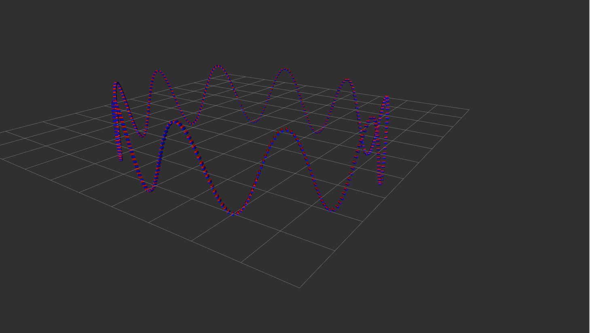
  Mid-point Method
  </td> 
  <td> 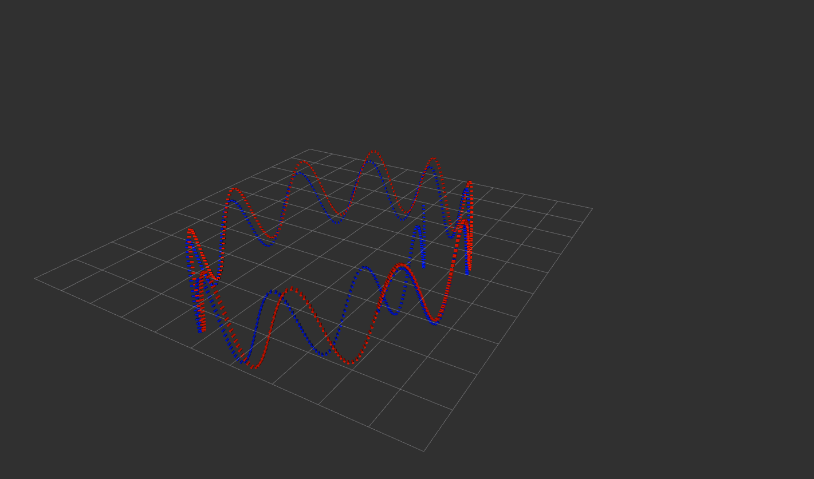
  Euler's Method
  </td> 
</table>

可以很明显的看出在这个轨迹中中值法比欧拉法好很多。

gnss_imu_sim:
首先需要将reference trajectory存入rosbag内,根据recorder_node_allan_variance_analysis.py：
将reference trajectory 取出
```
    for i, (gyro, accel, ref_pos, ref_att_quat) in enumerate(
        zip(
            # a. gyro
            sim.dmgr.get_data_all('gyro').data[0], 
            # b. accel
            sim.dmgr.get_data_all('accel').data[0],
            sim.dmgr.get_data_all('ref_pos').data,
            sim.dmgr.get_data_all('ref_att_quat').data
        )
    ):
        yield {
            'stamp': i * step_size,
            'data': {
                # a. gyro:
                'gyro_x': gyro[0],
                'gyro_y': gyro[1],
                'gyro_z': gyro[2],
                # b. accel:
                'accel_x': accel[0],
                'accel_y': accel[1],
                'accel_z': accel[2],
                # c. ref_position
                'pos_x': ref_pos[0] - origin_x,
                'pos_y': ref_pos[1] - origin_y,
                'pos_z': ref_pos[2] - origin_z,
                # d. quaternion
                'quat_w': ref_att_quat[0],
                'quat_x': ref_att_quat[1],
                'quat_y': ref_att_quat[2],
                'quat_z': ref_att_quat[3],
            }
        }
```

将reference trajectory存入/pose/ground_truth

```
            # Groundtruth Odom
            odom_msg = Odometry()
            odom_msg.header.frame_id = 'inertial'
            odom_msg.header.stamp = msg.header.stamp

            odom_msg.pose.pose.position.x =  measurement['data']['pos_x']   
            odom_msg.pose.pose.position.y =  measurement['data']['pos_y']  
            odom_msg.pose.pose.position.z =  measurement['data']['pos_z']   

            odom_msg.pose.pose.orientation.w = measurement['data']['quat_w']
            odom_msg.pose.pose.orientation.x = measurement['data']['quat_x']
            odom_msg.pose.pose.orientation.y = measurement['data']['quat_y']
            odom_msg.pose.pose.orientation.z = measurement['data']['quat_z']

            # write:
            bag.write(topic_name_imu, msg, msg.header.stamp)
            bag.write(topic_name_odom, odom_msg, odom_msg.header.stamp)
```

用gnss_imu_sim由于噪音比较大的imu数据导致可视化和效果可能更多是由于噪音造成的，而不是由算法的误差造成的，所以将噪音设置得比较小。

```
imu_err = {
        # 1. gyro:
        # a. random noise:
        # gyro angle random walk, deg/rt-hr
        'gyro_arw': np.array([0.05, 0.05, 0.05]),
        # gyro bias instability, deg/hr
        'gyro_b_stability': np.array([1.0, 1.0, 1.0]),
        # gyro bias isntability correlation time, sec
        'gyro_b_corr': np.array([10.0, 10.0, 10.0]),
        # b. deterministic error:
        'gyro_b': np.array([0.0, 0.0, 0.0]),
        'gyro_k': np.array([1, 1, 1]),
        'gyro_s': np.array([0.0, 0.0, 0.0, 0.0, 0.0, 0.0]),
        # 2. accel:
        # a. random noise:
        # accel velocity random walk, m/s/rt-hr
        'accel_vrw': np.array([0.00005, 0.00005, 0.00005]),
        # accel bias instability, m/s2
        'accel_b_stability': np.array([2.0e-7, 2.0e-7, 2.0e-7]),
        # accel bias isntability correlation time, sec
        'accel_b_corr': np.array([100.0, 100.0, 100.0]),
        # b. deterministic error:
        'accel_b': np.array([0.0e-3, 0.0e-3, 0.0e-3]),
        'accel_k': np.array([1.0, 1.0, 1.0]),
        'accel_s': np.array([0.0, 0.0, 0.0, 0.0, 0.0, 0.0]),
        # 3. mag:
        'mag_si': np.eye(3) + np.random.randn(3, 3)*0.0, 
        'mag_hi': np.array([10.0, 10.0, 10.0])*0.0,
        'mag_std': np.array([0.1, 0.1, 0.1])
    }
```

以下是用gnss_imu_sim生成的匀加速轨迹：

<table>
  <td> 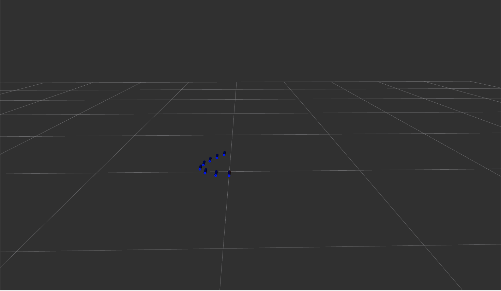
  Mid-point Method
  </td> 
  <td> 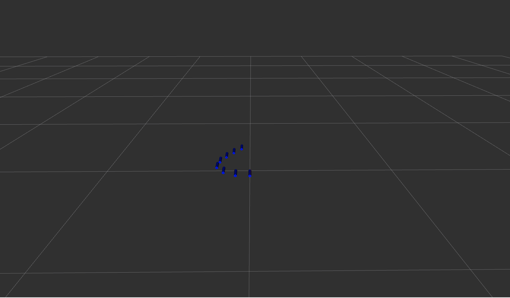
  Euler's Method
  </td> 
</table>

以下是用gnss_imu_sim生成的静止轨迹：

<table>
  <td> 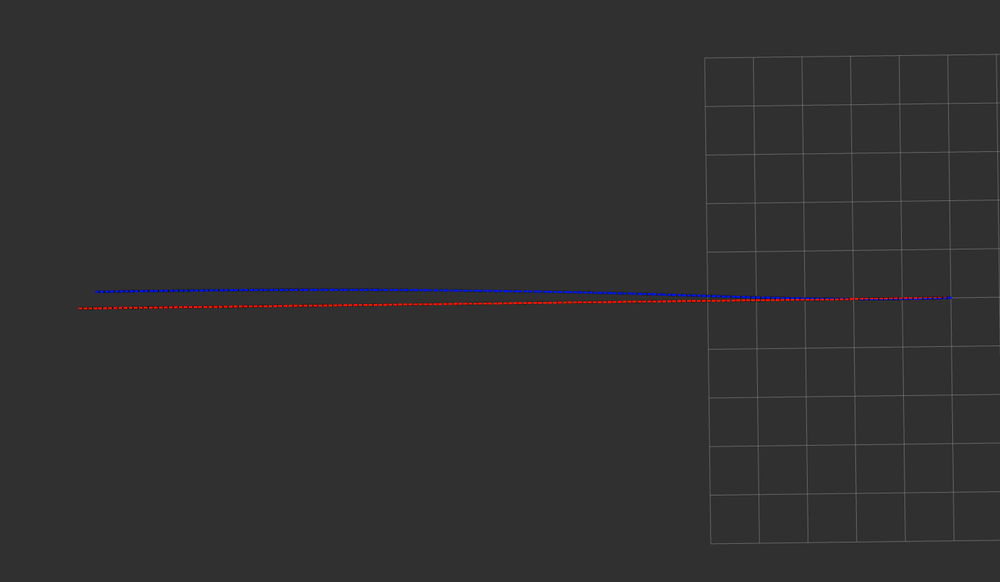
  Mid-point Method
  </td> 
  <td> 
  Euler's Method
  </td> 
</table>

可以看出在轨迹加速度的导数变化不大时，两种方法并没有很大的差距

以下是用gnss_imu_sim生成的200米跑道的形状：

<table>
  <td> 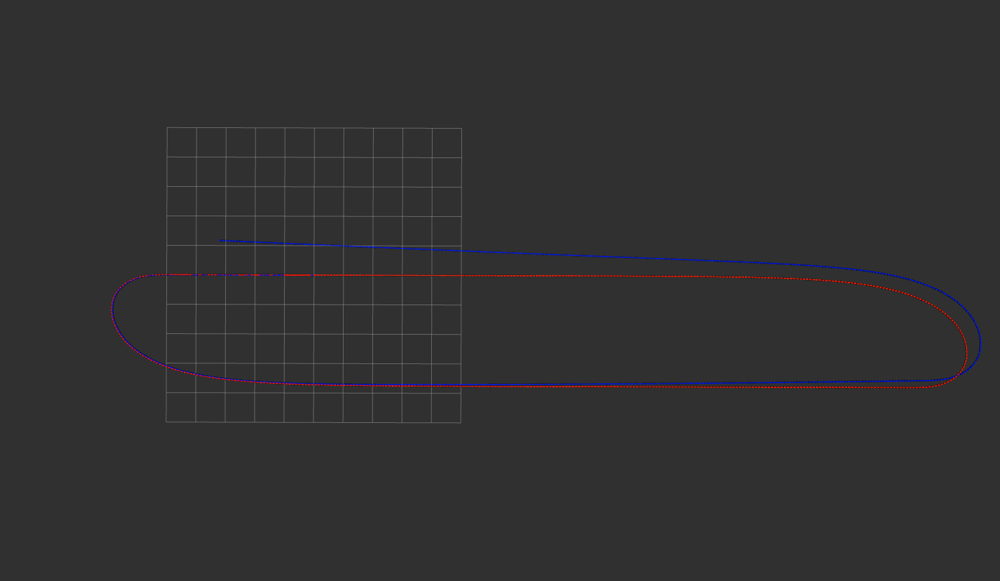
  Mid-point Method
  </td> 
  <td> 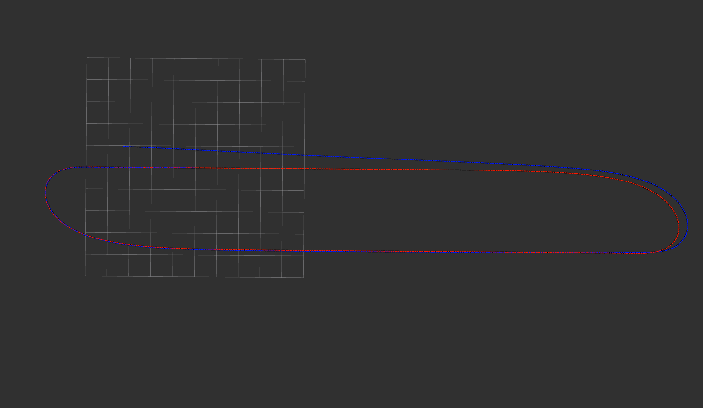
  Euler's Method
  </td> 
</table>

以下是用gnss_imu_sim生成的和上面差不多的输入，但是在掉头时给的时间很短导致角速度变化较大：

<table>
  <td> 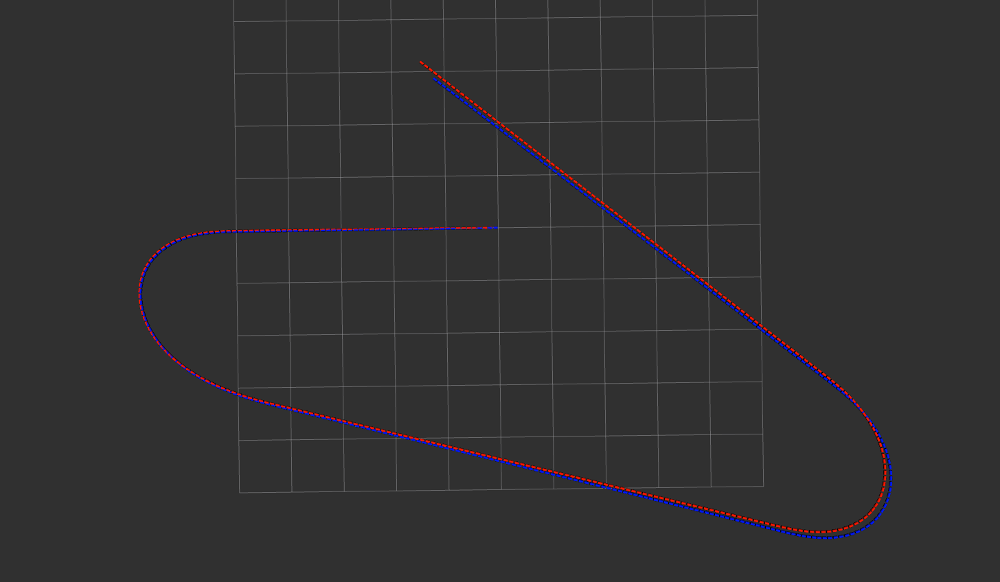
  Mid-point Method
  </td> 
  <td> 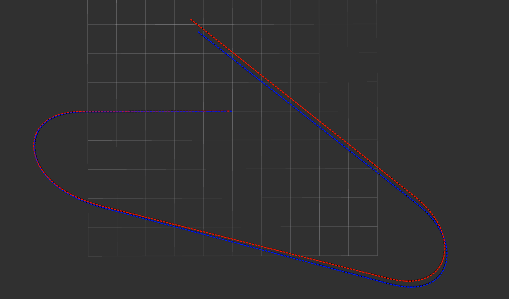
  Euler's Method
  </td> 
</table>

可以看出在第一组图里，欧拉法反倒是更好的效果，具体原因也不是很清楚。
但是在第二组图里，由于角速度变化过快，中值法明显优于欧拉法。

最后我将gnss_imu_sim的噪声改大了一些：

```
imu_err = {
        # 1. gyro:
        # a. random noise:
        # gyro angle random walk, deg/rt-hr
        'gyro_arw': np.array([0.1, 0.1, 0.1]),
        # gyro bias instability, deg/hr
        'gyro_b_stability': np.array([1.0, 1.0, 1.0]),
        # gyro bias isntability correlation time, sec
        'gyro_b_corr': np.array([10.0, 10.0, 10.0]),
        # b. deterministic error:
        'gyro_b': np.array([0.0, 0.0, 0.0]),
        'gyro_k': np.array([1, 1, 1]),
        'gyro_s': np.array([0.0, 0.0, 0.0, 0.0, 0.0, 0.0]),
        # 2. accel:
        # a. random noise:
        # accel velocity random walk, m/s/rt-hr
        'accel_vrw': np.array([0.005, 0.005, 0.005]),
        # accel bias instability, m/s2
        'accel_b_stability': np.array([2.0e-6, 2.0e-6, 2.0e-6]),
        # accel bias isntability correlation time, sec
        'accel_b_corr': np.array([100.0, 100.0, 100.0]),
        # b. deterministic error:
        'accel_b': np.array([0.0e-3, 0.0e-3, 0.0e-3]),
        'accel_k': np.array([1.0, 1.0, 1.0]),
        'accel_s': np.array([0.0, 0.0, 0.0, 0.0, 0.0, 0.0]),
        # 3. mag:
        'mag_si': np.eye(3) + np.random.randn(3, 3)*0.0, 
        'mag_hi': np.array([10.0, 10.0, 10.0])*0.0,
        'mag_std': np.array([0.1, 0.1, 0.1])
    }
```

<table>
  <td> 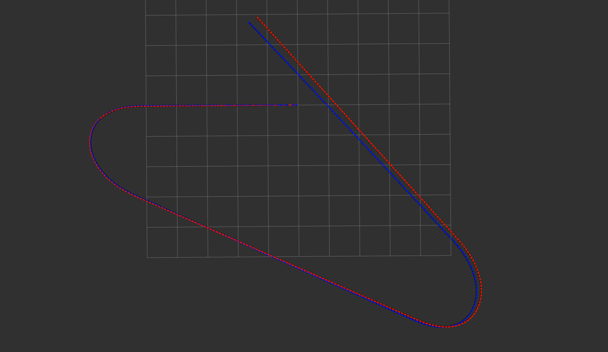
  Mid-point Method
  </td> 
  <td> 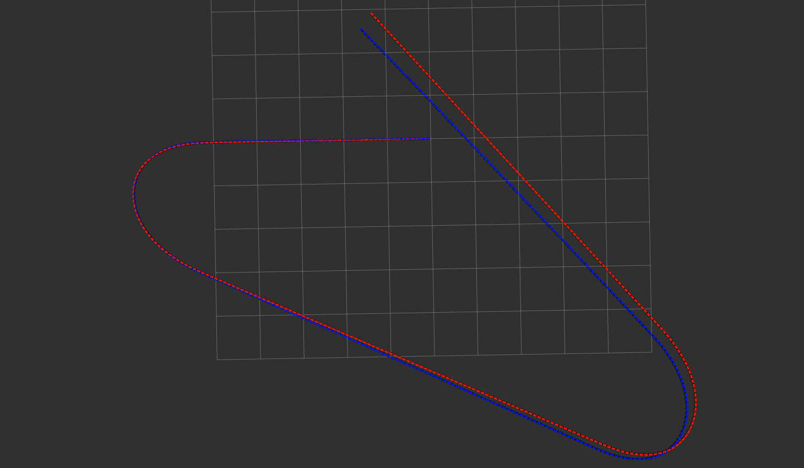
  Euler's Method
  </td> 
</table>

由于噪音的变化两种算法都受到影响更大，但是哪种算法收到噪音的影响更大还需要更深一步的探索。但是由于中值法有一个平均的步骤，相当于一个长度为2的movmean filter所以感觉上中值法会比欧拉法受到的噪音更小一些
