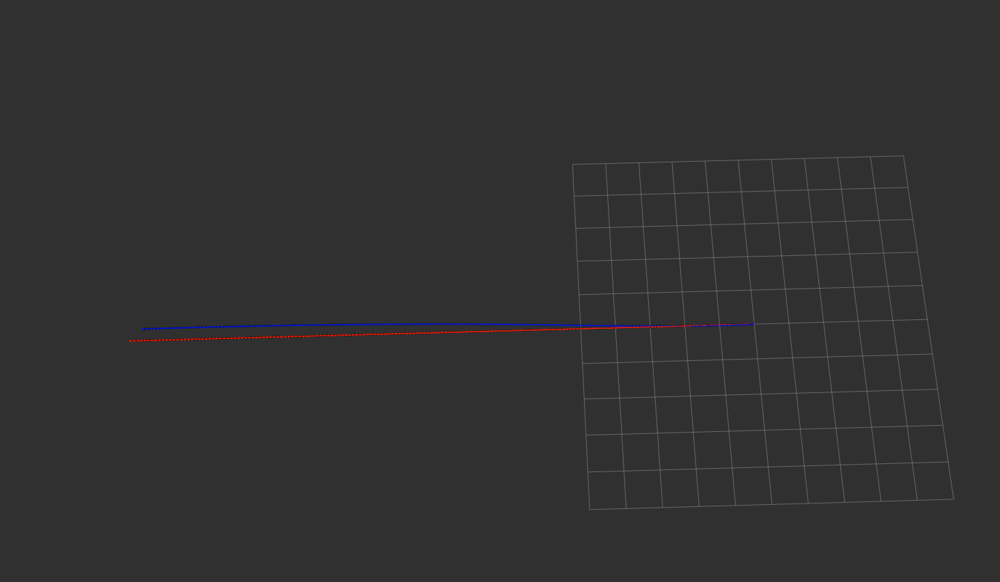

Mid Point Method vs Euler's Method：

<table>
  <td> 
  Mid-point Method
  </td> 
  <td> 
  Euler's Method
  </td> 
</table>

用gnss_imu_sim由于噪音比较大的imu数据导致可视化和效果可能更多是由于噪音造成的，而不是由算法的误差造成的，所以将噪音设置得成比较小。

```
imu_err = {
        # 1. gyro:
        # a. random noise:
        # gyro angle random walk, deg/rt-hr
        'gyro_arw': np.array([0.05, 0.05, 0.05]),
        # gyro bias instability, deg/hr
        'gyro_b_stability': np.array([1.0, 1.0, 1.0]),
        # gyro bias isntability correlation time, sec
        'gyro_b_corr': np.array([10.0, 10.0, 10.0]),
        # b. deterministic error:
        'gyro_b': np.array([0.0, 0.0, 0.0]),
        'gyro_k': np.array([1, 1, 1]),
        'gyro_s': np.array([0.0, 0.0, 0.0, 0.0, 0.0, 0.0]),
        # 2. accel:
        # a. random noise:
        # accel velocity random walk, m/s/rt-hr
        'accel_vrw': np.array([0.00005, 0.00005, 0.00005]),
        # accel bias instability, m/s2
        'accel_b_stability': np.array([2.0e-7, 2.0e-7, 2.0e-7]),
        # accel bias isntability correlation time, sec
        'accel_b_corr': np.array([100.0, 100.0, 100.0]),
        # b. deterministic error:
        'accel_b': np.array([0.0e-3, 0.0e-3, 0.0e-3]),
        'accel_k': np.array([1.0, 1.0, 1.0]),
        'accel_s': np.array([0.0, 0.0, 0.0, 0.0, 0.0, 0.0]),
        # 3. mag:
        'mag_si': np.eye(3) + np.random.randn(3, 3)*0.0, 
        'mag_hi': np.array([10.0, 10.0, 10.0])*0.0,
        'mag_std': np.array([0.1, 0.1, 0.1])
    }
```

以下是用gnss_imu_sim生成的匀加速轨迹：

<table>
  <td> 
  Mid-point Method
  </td> 
  <td> 
  Euler's Method
  </td> 
</table>

以下是用gnss_imu_sim生成的静止轨迹：

<table>
  <td> 
  Mid-point Method
  </td> 
  <td> 
  Euler's Method
  </td> 
</table>

可以看出在轨迹加速度的导数变化不大时，两种方法并没有很大的差距

以下是用gnss_imu_sim生成的200米跑道的形状：

<table>
  <td> 
  Mid-point Method
  </td> 
  <td> 
  Euler's Method
  </td> 
</table>

以下是用gnss_imu_sim生成的和上面差不多的输入，但是在掉头时给的时间很短导致角速度变化较大：

<table>
  <td> 
  Mid-point Method
  </td> 
  <td> 
  Euler's Method
  </td> 
</table>

可以看出在第一组图里，欧拉法反倒是更好的效果，具体原因也不是很清楚。
但是在第二组图里，由于角速度变化过快，中值法明显优于欧拉法。

最后我将gnss_imu_sim的噪声改大了一些：

```
imu_err = {
        # 1. gyro:
        # a. random noise:
        # gyro angle random walk, deg/rt-hr
        'gyro_arw': np.array([0.1, 0.1, 0.1]),
        # gyro bias instability, deg/hr
        'gyro_b_stability': np.array([1.0, 1.0, 1.0]),
        # gyro bias isntability correlation time, sec
        'gyro_b_corr': np.array([10.0, 10.0, 10.0]),
        # b. deterministic error:
        'gyro_b': np.array([0.0, 0.0, 0.0]),
        'gyro_k': np.array([1, 1, 1]),
        'gyro_s': np.array([0.0, 0.0, 0.0, 0.0, 0.0, 0.0]),
        # 2. accel:
        # a. random noise:
        # accel velocity random walk, m/s/rt-hr
        'accel_vrw': np.array([0.005, 0.005, 0.005]),
        # accel bias instability, m/s2
        'accel_b_stability': np.array([2.0e-6, 2.0e-6, 2.0e-6]),
        # accel bias isntability correlation time, sec
        'accel_b_corr': np.array([100.0, 100.0, 100.0]),
        # b. deterministic error:
        'accel_b': np.array([0.0e-3, 0.0e-3, 0.0e-3]),
        'accel_k': np.array([1.0, 1.0, 1.0]),
        'accel_s': np.array([0.0, 0.0, 0.0, 0.0, 0.0, 0.0]),
        # 3. mag:
        'mag_si': np.eye(3) + np.random.randn(3, 3)*0.0, 
        'mag_hi': np.array([10.0, 10.0, 10.0])*0.0,
        'mag_std': np.array([0.1, 0.1, 0.1])
    }
```

<table>
  <td> 
  Mid-point Method
  </td> 
  <td> 
  Euler's Method
  </td> 
</table>

由于噪音的变化两种算法都受到影响更大，但是哪种算法收到噪音的影响更大还需要更深一步的探索。但是由于中值法有一个平均的步骤，相当于一个长度为2的movmean filter所以感觉上中值法会比欧拉法受到的噪音更小一些
