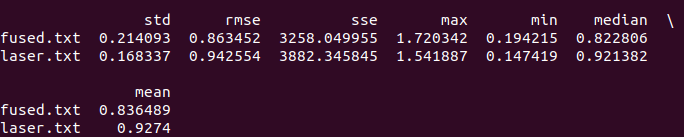

补全代码：

UpdateOdomEstimation: 用imu信息更新先验。和第六章作业一样。区别是我们只是用这个函数的输出来建构process公式，而不是直接用积分出来的值当作状态量。
```
void ErrorStateKalmanFilter::UpdateOdomEstimation(
    Eigen::Vector3d &linear_acc_mid, Eigen::Vector3d &angular_vel_mid) {
  //
  // TODO: this is one possible solution to previous chapter, IMU Navigation,
  // assignment
  //
  // get deltas:
  Eigen::Vector3d angular_delta, vel_delta;
  Eigen::Matrix3d R_p, R_c;
  double dt;
  angular_delta.setZero();
  vel_delta.setZero();
  R_p.setZero();
  R_c.setZero();

  GetAngularDelta(1, 0, angular_delta, angular_vel_mid);

  // update orientation:
  UpdateOrientation(angular_delta, R_c, R_p);

  // get velocity delta:
  GetVelocityDelta(1, 0, R_c, R_p, dt, vel_delta, linear_acc_mid);

  // update position:
  UpdatePosition(dt, vel_delta);
}
```

SetProcessEquation：用IMU积分出来的值架构线性化的状态更新方程
```
void ErrorStateKalmanFilter::SetProcessEquation(const Eigen::Matrix3d &C_nb,
                                                const Eigen::Vector3d &f_n,
                                                const Eigen::Vector3d &w_b) {
  // TODO: set process / system equation:
  // a. set process equation for delta vel:
  F_.block<3, 3>(kIndexErrorVel, kIndexErrorOri) = -C_nb * Sophus::SO3d::hat(f_n).matrix();
  F_.block<3, 3>(kIndexErrorVel, kIndexErrorAccel) = -C_nb;
  B_.block<3, 3>(kIndexErrorVel, kIndexErrorPos) = C_nb;

  // b. set process equation for delta ori:
  F_.block<3, 3>(kIndexErrorOri, kIndexErrorOri) = -Sophus::SO3d::hat(w_b).matrix();
}
```

UpdateErrorEstimation： 使用SetProcessEquation给出的公式来更新状态量，因为是离散时间所以要乘以时间差
```
void ErrorStateKalmanFilter::UpdateErrorEstimation(
    const double &T, const Eigen::Vector3d &linear_acc_mid,
    const Eigen::Vector3d &angular_vel_mid) {
  static MatrixF F_1st;
  static MatrixF F_2nd;
  // TODO: update process equation:
  UpdateProcessEquation(linear_acc_mid, angular_vel_mid);
  // TODO: get discretized process equations:
  F_1st = F_ * T;
  F_2nd = MatrixF::Identity() + F_1st;

  B_.block<3, 3>(kIndexErrorVel, kIndexNoiseAccel) *= T;
  B_.block<3, 3>(kIndexErrorOri, kIndexNoiseGyro) *= T;
  B_.block<3, 3>(kIndexErrorAccel, kIndexNoiseBiasAccel) *= sqrt(T);
  B_.block<3, 3>(kIndexErrorGyro, kIndexNoiseBiasGyro) *= sqrt(T);
  // TODO: perform Kalman prediction
  X_ = F_2nd * X_;
  P_ = F_2nd * P_ * F_2nd.transpose() + B_ * Q_ * B_.transpose();
}
```

CorrectErrorEstimationPose:利用观测结果计算观测与预测之差，并且计算出卡尔曼增量
```
void ErrorStateKalmanFilter::CorrectErrorEstimationPose(
    const Eigen::Matrix4d &T_nb, Eigen::VectorXd &Y, Eigen::MatrixXd &G,
    Eigen::MatrixXd &K) {
  //
  // TODO: set measurement:
  //
  Eigen::Vector3d dx = pose_.block<3,1>(0,3) - T_nb.block<3,1>(0,3);
  Eigen::Matrix3d dR = T_nb.block<3,3>(0,0).transpose() * pose_.block<3, 3>(0,0);
  Eigen::Vector3d dtheta = Sophus::SO3d::vee(dR - Eigen::Matrix3d::Identity()); 

  YPose_.head(3) = dx;
  YPose_.tail(3) = dtheta;
  Y = YPose_;

  // TODO: set measurement equation:
  G = GPose_;

  // TODO: set Kalman gain:              
  K.setZero();
  K = P_ * G.transpose() * (G * P_ * G.transpose() + CPose_ * RPose_ * CPose_.transpose()).inverse();
}
```

CorrectErrorEstimation：利用CorrectErrorEstimationPose给出的卡尔曼增量和误差，更新后验状态量
```
void ErrorStateKalmanFilter::CorrectErrorEstimation(
    const MeasurementType &measurement_type, const Measurement &measurement) {
  //
  // TODO: understand ESKF correct workflow
  //
  Eigen::VectorXd Y;
  Eigen::MatrixXd G, K;
  switch (measurement_type) {
  case MeasurementType::POSE:
    CorrectErrorEstimationPose(measurement.T_nb, Y, G, K);
    break;
  default:
    break;
  }

  // TODO: perform Kalman correct:
  X_ += K * (Y - G * X_);
  P_ = (MatrixP::Identity() - K * G) * P_;
}
```

EliminateError：由于我们用的是error state KF，计算出的状态量为状态更新量，这一步目的为更新状态量。由于我们课件定义方式，我们需要减去更新量。之后在ResetState函数中将更新量清零
```
void ErrorStateKalmanFilter::EliminateError(void) {
  //
  // TODO: correct state estimation using the state of ESKF
  //
  // a. position:
  // do it!
  pose_.block<3,1>(0,3) -= X_.block<3,1>(kIndexErrorPos, 0);
  // b. velocity:
  // do it!
  vel_ -= X_.block<3,1>(kIndexErrorVel, 0);
  // c. orientation:
  // do it!
  Eigen::Quaterniond temp_quat(pose_.block<3,3>(0,0) * (Eigen::Matrix3d::Identity() - Sophus::SO3d::hat((X_.block<3, 1>(kIndexErrorOri, 0)))));
  temp_quat.normalize();
  pose_.block<3,3>(0,0) = temp_quat.toRotationMatrix();

  // d. gyro bias:
  if (IsCovStable(kIndexErrorGyro)) {
    gyro_bias_ -= X_.block<3, 1>(kIndexErrorGyro, 0);
  }

  // e. accel bias:
  if (IsCovStable(kIndexErrorAccel)) {
    accl_bias_ -= X_.block<3, 1>(kIndexErrorAccel, 0);
  }
}
```

结果：
原始参数：



<table>
  <td> 
  Mid-point Method
  </td> 
  <td> 
  Euler's Method
  </td> 
</table>

可以看出fused比icp的效果好多了。误差很大一部分我感觉是map的问题。因为感觉激光的icp其实对应map的点云其实很准（至少小于0.85m)

修改参数为：


因为想要更信任gyro的数据，将gyro的方差改小到1*10^(-5)。总体差别不大。效果区别不是很大，但是稍微好了一些。


继续将先验的方差增加到1*10^(-5)，目的是让卡尔曼滤波每次更新更加自由一些，更加信任icp的结果。效果也差不了多少


试图将测量的方差增加到1*10^(-3)，目的为更加信任imu，结果可见得fused和laser的误差更加相近了


减小光测的位置方差减小到1*10^(-5)，目的是用姿态信任imu，而位置信任icp，但是效果反而不佳


增加加速计的方差到2.5*10^(-4)，结果和想象的一样效果更差了。
感觉要真正评测滤波的有效性，还是的要重新跑一下第四章的mapping。


不考虑随机游走的推导过程：


需要修改的地方：


```
  if (COV.BIAS_RANDOM_WALK)
  {
    Q_.block<3, 3>(kIndexNoiseBiasAccel, kIndexNoiseBiasAccel) = COV.PROCESS.BIAS_ACCEL * Eigen::Matrix3d::Identity();
    Q_.block<3, 3>(kIndexNoiseBiasGyro, kIndexNoiseBiasGyro) = COV.PROCESS.BIAS_GYRO * Eigen::Matrix3d::Identity();
  }

  // d. measurement noise:
  RPose_.block<3, 3>(0, 0) = COV.MEASUREMENT.POSE.POSI * Eigen::Matrix3d::Identity();
  RPose_.block<3, 3>(3, 3) = COV.MEASUREMENT.POSE.ORI * Eigen::Matrix3d::Identity();

  // e. process equation:
  F_.block<3, 3>(kIndexErrorPos, kIndexErrorVel) = Eigen::Matrix3d::Identity();
  F_.block<3, 3>(kIndexErrorOri, kIndexErrorGyro) = -Eigen::Matrix3d::Identity();

  B_.block<3, 3>(kIndexErrorOri, kIndexNoiseGyro) = Eigen::Matrix3d::Identity();
  if (COV.BIAS_RANDOM_WALK)
  {
    B_.block<3, 3>(kIndexErrorAccel, kIndexNoiseBiasAccel) = Eigen::Matrix3d::Identity();
    B_.block<3, 3>(kIndexErrorGyro, kIndexNoiseBiasGyro) = Eigen::Matrix3d::Identity();
  }
```

效果：


实际区别其实不大
