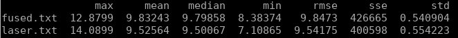
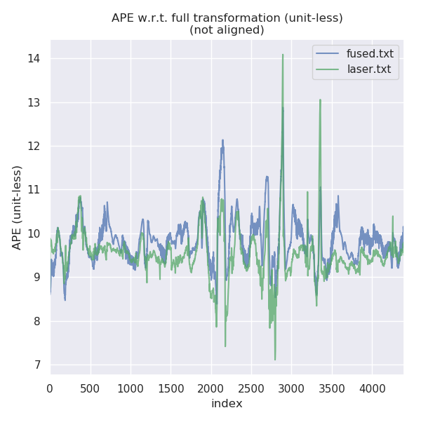
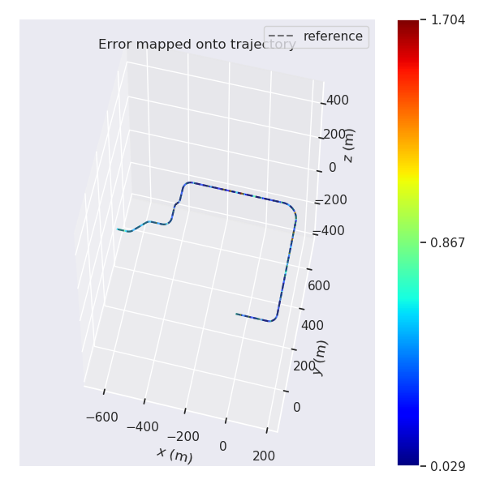
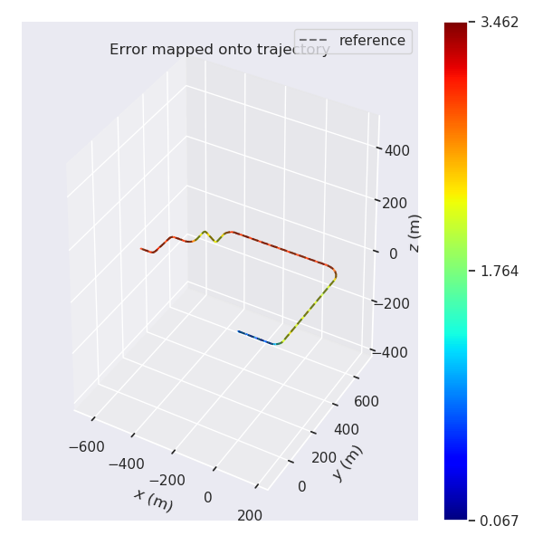

补全代码：

CorrectErrorEstimationPoseVel: 和第七章作业一样。区别是我们只是加了一个速度的观测然后加上对应的G矩阵的元素就行了
```
void ErrorStateKalmanFilter::CorrectErrorEstimationPoseVel(
    const Eigen::Matrix4d &T_nb, const Eigen::Vector3d &v_b, const Eigen::Vector3d &w_b,
    Eigen::VectorXd &Y, Eigen::MatrixXd &G, Eigen::MatrixXd &K
) {
    //
    // TODO: set measurement:
    //
    Eigen::Vector3d dx = pose_.block<3,1>(0,3) - T_nb.block<3,1>(0,3);
    Eigen::Vector3d dv = T_nb.block<3,3>(0,0).transpose() * vel_ - Eigen::Vector3d{v_b[0], 0, 0};
    Eigen::Matrix3d dR = T_nb.block<3,3>(0,0).transpose() * pose_.block<3, 3>(0,0);
    Eigen::Vector3d dtheta = Sophus::SO3d::vee(dR - Eigen::Matrix3d::Identity()); 

    YPoseVel_.head(3) = dx;
    YPoseVel_.block<3,1>(3,0) = dv;
    YPoseVel_.tail(3) = dtheta;
    Y = YPoseVel_;

    // TODO: set measurement equation:
    GPoseVel_.block<3,3>(3,3) = pose_.block<3,3>(0,0).transpose();
    GPoseVel_.block<3,3>(3,6) = Sophus::SO3d::hat(pose_.block<3,3>(0,0).transpose() * vel_);
    G = GPoseVel_;

    // TODO: set Kalman gain:              
    K.setZero();
    K = P_ * G.transpose() * (G * P_ * G.transpose() + CPoseVel_ * RPoseVel_ * CPoseVel_.transpose()).inverse();
}
```

结果：





误差很大一部分我感觉是map的问题。因为感觉激光的icp其实对应map的点云挺准的，至少在10米之内。但是用第四章的地图也不行。好象是第四章存下来的scan context的proto版本不对。

CorrectErrorEstimationPosiVel：去掉姿态部分就行了推导公式在代码后
```
void ErrorStateKalmanFilter::CorrectErrorEstimationPosiVel(
    const Eigen::Matrix4d &T_nb, const Eigen::Vector3d &v_b, const Eigen::Vector3d &w_b,
    Eigen::VectorXd &Y, Eigen::MatrixXd &G, Eigen::MatrixXd &K
) {
    Eigen::Vector3d dx = pose_.block<3,1>(0,3) - T_nb.block<3,1>(0,3);
    Eigen::Vector3d dv = pose_.block<3,3>(0,0).transpose() * vel_ - Eigen::Vector3d{v_b[0], 0, 0};

    YPosiVel_.head(3) = dx;
    YPosiVel_.tail(3) = dv;

    Y = YPosiVel_;

    // TODO: set measurement equation:
    GPosiVel_.block<3,3>(3,3) = pose_.block<3,3>(0,0).transpose();
    GPosiVel_.block<3,3>(3,6) = Sophus::SO3d::hat(pose_.block<3,3>(0,0).transpose() * vel_);
    G = GPosiVel_;

    // TODO: set Kalman gain:              
    K.setZero();
    K = P_ * G.transpose() * (G * P_ * G.transpose() + CPosiVel_ * RPosiVel_ * CPosiVel_.transpose()).inverse();
}
```
这一章有一点要注意就是pose_和T_nb的区别。pose_是当前的状态量(x)，T_nb是观测量(y)，所以在计算的时候基本都要用pose_，只有在计算观测量与状态量之差才会用。

效果


<table>
  <td> 
  Fused Error
  </td> 
  <td> 
  Fused Trajectory
  </td> 
</table>
<table>
  <td> 
  GNSS Error
  </td> 
  <td> 
  GNSS Trajectory
  </td> 
</table>


