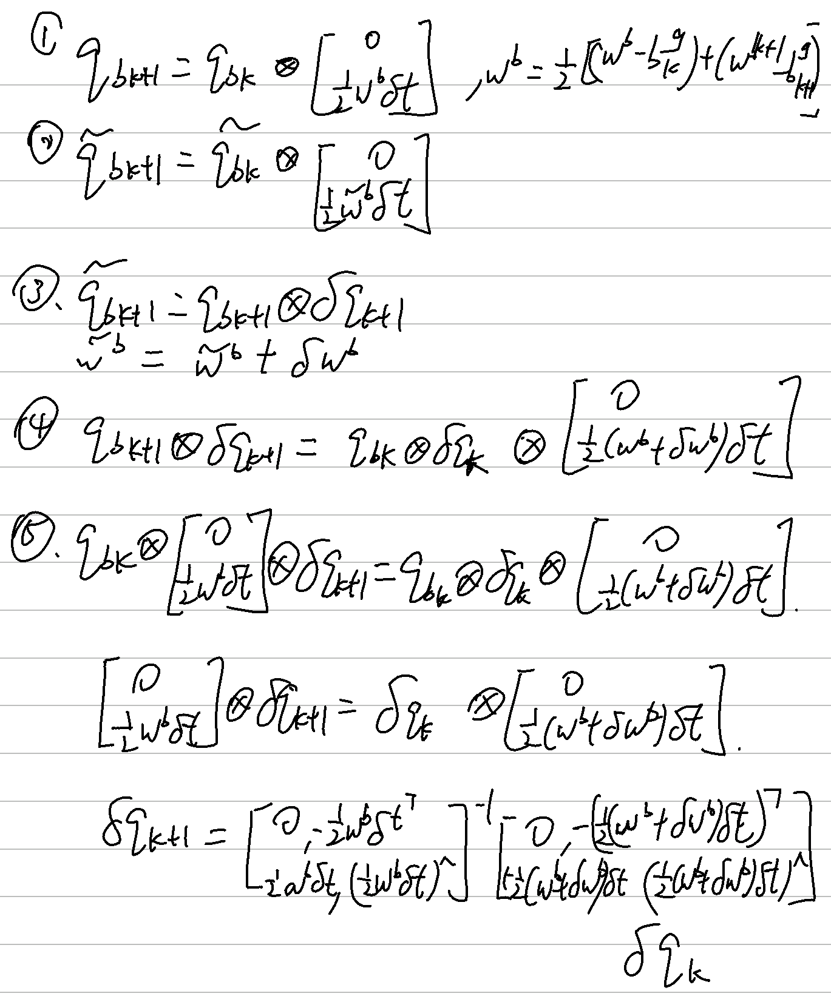

公式推导：

 
 
 
 
 
 

补全代码：

UpdateState: 中值法更新最优先验，然后F和B相对应的值补进去就行了
```
void IMUPreIntegrator::UpdateState(void) {
...
    //
    // TODO: a. update mean:
    //
    // 1. get w_mid:
    w_mid = 0.5 * (prev_w + curr_w);
    // 2. update relative orientation, so3:
    prev_theta_ij = state.theta_ij_;
    d_theta_ij = Sophus::SO3d::exp(w_mid*T);
    curr_theta_ij = prev_theta_ij * d_theta_ij;
    state.theta_ij_ = curr_theta_ij;
    // 3. get a_mid:
    a_mid = 0.5 * (prev_a + curr_a);
    // 4. update relative translation:
    state.alpha_ij_ += state.beta_ij_*T + 0.5*a_mid*T*T;
    // 5. update relative velocity:
    state.beta_ij_ += a_mid*T;
    
    //
    // TODO: b. update covariance:
    //
    // 1. intermediate results:
    dR_inv = d_theta_ij.inverse().matrix();
    prev_R = prev_theta_ij.matrix();
    curr_R = curr_theta_ij.matrix();
    prev_R_a_hat = prev_R * Sophus::SO3d::hat(prev_a);
    curr_R_a_hat = curr_R * Sophus::SO3d::hat(curr_a);
    //
    // TODO: 2. set up F:
    //
    // F12 & F32:
    F_ = MatrixF::Identity();
    F_.block<3,3>(INDEX_ALPHA, INDEX_THETA) = -0.25*T*T * (prev_R_a_hat + curr_R_a_hat*(Eigen::Matrix3d::Identity() - Sophus::SO3d::hat(w_mid)*T));
    F_.block<3,3>(INDEX_BETA, INDEX_THETA) = -0.5*T * (prev_R_a_hat + curr_R_a_hat*(Eigen::Matrix3d::Identity() - Sophus::SO3d::hat(w_mid)*T));
    // F14 & F34:
    F_.block<3,3>(INDEX_ALPHA, INDEX_B_A) = -0.25 * (prev_R + curr_R) * T*T;
    F_.block<3,3>(INDEX_BETA, INDEX_B_A) = -0.5 * (prev_R + curr_R) * T;
    // F15 & F35:
    F_.block<3,3>(INDEX_ALPHA, INDEX_B_G) = 0.25*T*T*T * curr_R_a_hat;
    F_.block<3,3>(INDEX_BETA, INDEX_B_G) = 0.5*T*T * curr_R_a_hat;
    // F22:
    F_.block<3,3>(INDEX_THETA, INDEX_THETA) = Eigen::Matrix3d::Identity() - Sophus::SO3d::hat(w_mid)*T;
    //
    // TODO: 3. set up G:
    //
    // G11 & G31:
    B_ = MatrixB::Zero();
    B_.block<3,3>(INDEX_ALPHA, INDEX_M_ACC_PREV) = 0.25*T*T * prev_R;
    B_.block<3,3>(INDEX_BETA, INDEX_M_ACC_PREV) = 0.5*T * prev_R;
    // G12 & G22 & G32:
    B_.block<3,3>(INDEX_ALPHA, INDEX_M_GYR_PREV) = -0.125*T*T*T * curr_R_a_hat;
    B_.block<3,3>(INDEX_THETA, INDEX_M_GYR_PREV) = 0.5*Eigen::Matrix3d::Identity()*T;
    B_.block<3,3>(INDEX_BETA, INDEX_M_GYR_PREV) = -0.25*T*T * curr_R_a_hat;
    // G13 & G33:
    B_.block<3,3>(INDEX_ALPHA, INDEX_M_ACC_CURR) = 0.25 * curr_R * T*T;
    B_.block<3,3>(INDEX_BETA, INDEX_M_ACC_CURR) = 0.5 * curr_R * T;
    // G14 & G24 & G34:
    B_.block<3,3>(INDEX_ALPHA, INDEX_M_GYR_CURR) = -0.125*T*T*T * curr_R_a_hat;
    B_.block<3,3>(INDEX_THETA, INDEX_M_GYR_CURR) = 0.5*Eigen::Matrix3d::Identity()*T;
    B_.block<3,3>(INDEX_BETA, INDEX_M_GYR_CURR) = -0.25*T*T * curr_R_a_hat;
    // G45
    B_.block<3,3>(INDEX_B_A, INDEX_R_ACC_PREV) = Eigen::Matrix3d::Identity() * T;
    // G56
    B_.block<3,3>(INDEX_B_G, INDEX_R_GYR_PREV) = Eigen::Matrix3d::Identity() * T;
    // TODO: 4. update P_:
    P_ = F_ * P_ * F_.transpose() + B_ * Q_ * B_.transpose();
    // 
    // TODO: 5. update Jacobian:
    //
    J_ = F_ * J_;
}
```

oplusImpl：g2o更新状态量用的函数，除了姿态比较特殊外，其他直接用加法就行了。也要更新Vertex中对应的bias
```
virtual void oplusImpl(const double *update) override {
        //
        // TODO: do update
        //
        Eigen::Map<const Eigen::Matrix<double, 15, 1>> update_vec(update, 15);
        _estimate.pos += update_vec.block<3,1>(PRVAG::INDEX_POS, 0);
        _estimate.ori = _estimate.ori * Sophus::SO3d::exp(update_vec.block<3,1>(PRVAG::INDEX_ORI, 0));
        _estimate.vel += update_vec.block<3,1>(PRVAG::INDEX_VEL, 0);
        _estimate.b_a += update_vec.block<3,1>(PRVAG::INDEX_B_A, 0);
        _estimate.b_g += update_vec.block<3,1>(PRVAG::INDEX_B_G, 0);
        updateDeltaBiases(update_vec.block<3,1>(PRVAG::INDEX_B_A, 0), update_vec.block<3,1>(PRVAG::INDEX_B_G, 0));
    }
```


computeError：在Edge里面计算误差值，基本上就是先用bias更新预积分之后吧误差公式添上就行了。
```
virtual void computeError() override {
        g2o::VertexPRVAG* v0 = dynamic_cast<g2o::VertexPRVAG*>(_vertices[0]);
        g2o::VertexPRVAG* v1 = dynamic_cast<g2o::VertexPRVAG*>(_vertices[1]);

		const Eigen::Vector3d &pos_i = v0->estimate().pos;
		const Sophus::SO3d    &ori_i = v0->estimate().ori;
		const Eigen::Vector3d &vel_i = v0->estimate().vel;
		const Eigen::Vector3d &b_a_i = v0->estimate().b_a;
		const Eigen::Vector3d &b_g_i = v0->estimate().b_g;

		const Eigen::Vector3d &pos_j = v1->estimate().pos;
		const Sophus::SO3d    &ori_j = v1->estimate().ori;
		const Eigen::Vector3d &vel_j = v1->estimate().vel;
		const Eigen::Vector3d &b_a_j = v1->estimate().b_a;
		const Eigen::Vector3d &b_g_j = v1->estimate().b_g;

		//
		// TODO: update pre-integration measurement caused by bias change:
		// 

		if (v0 -> isUpdated() ) {
			Eigen::Vector3d  d_b_a_i , d_b_g_i ;
			v0->getDeltaBiases(d_b_a_i, d_b_g_i);
			updateMeasurement(d_b_a_i,d_b_g_i);
		}

		//
		// TODO: compute error:
		//
		const Eigen::Vector3d &alpha_ij = _measurement.block<3, 1>(INDEX_P, 0);
		const Eigen::Vector3d &theta_ij = _measurement.block<3, 1>(INDEX_R, 0);
		const Eigen::Vector3d &beta_ij = _measurement.block<3, 1>(INDEX_V, 0);
		// const Sophus::SO3d residual_ori_quat = (Sophus::SO3d::exp(theta_ij).inverse() * ori_i.inverse() * ori_j);
		// const Eigen::Vector3d residual_ori(residual_ori_quat.unit_quaternion().x(), residual_ori_quat.unit_quaternion().y(), residual_ori_quat.unit_quaternion().z());
		_error.block<3, 1>(INDEX_P, 0) = ori_i.matrix() * (pos_j - pos_i - vel_i*T_ + 0.5*g_*T_*T_) - alpha_ij;
		_error.block<3, 1>(INDEX_R, 0) = (Sophus::SO3d::exp(theta_ij).inverse() * ori_i.inverse() * ori_j).log();
		_error.block<3, 1>(INDEX_V, 0) = ori_i.inverse() * (vel_j - vel_i + g_ * T_) - beta_ij;
		_error.block<3, 1>(INDEX_A, 0) = b_a_j - b_a_i;
		_error.block<3, 1>(INDEX_G, 0) = b_g_j - b_g_i;
    }
```


这一章有一点要注意就是pose_和T_nb的区别。pose_是当前的状态量(x)，T_nb是观测量(y)，所以在计算的时候基本都要用pose_，只有在计算观测量与状态量之差才会用T_nb。

效果：
<table>
  <td> 
  
  用IMU预积分 
  
  
   
   
   </td>
  <td> 
  
  不用IMU预积分
  
  
  
  
   </td>
</table>

可以看出用IMU预积分反而效果变差了，应该是KITTI数据集的缘故


优秀部分：

 
 
 
 
 
 
 
