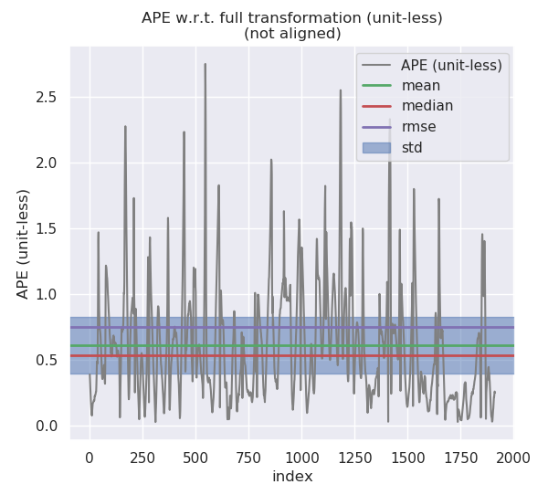
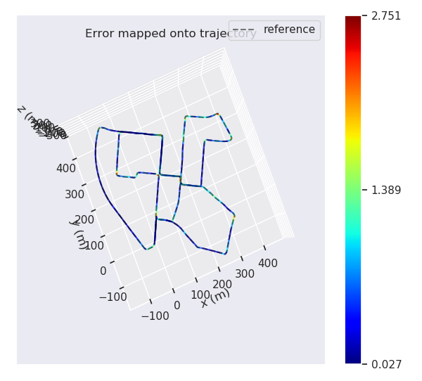

公式推导：

 
 
 
 


补全代码：
lidar_localization/src/matching/back_end/sliding_window.cpp
Update: 将最新的数据加入sliding_window，如果是第一个关键帧，设置成fixed，然后一个个把相应信息加进去就行了，（Map Matching，Relative Pose，和IMU Preintegration）
```
bool SlidingWindow::Update(void) {
    static KeyFrame last_key_frame_ = current_key_frame_;

    //
    // add node for new key frame pose:
    //
    // fix the pose of the first key frame for lidar only mapping:
    if ( sliding_window_ptr_->GetNumParamBlocks() == 0 ) {
        // TODO: add init key frame
        sliding_window_ptr_->AddPRVAGParam(current_key_frame_, true);
    } else {
        // TODO: add current key frame
        sliding_window_ptr_->AddPRVAGParam(current_key_frame_, false);
    }

    // get num. of vertices:
    const int N = sliding_window_ptr_->GetNumParamBlocks();
    // get param block ID, current:
    const int param_index_j = N - 1;

    //
    // add unary constraints:
    //
    //
    // a. map matching / GNSS position:
    //
    std::cout << "Adding Map Matching Factors" << std::endl;
    if ( N > 0 && measurement_config_.source.map_matching ) {
        // get prior position measurement:
        Eigen::Matrix4d prior_pose = current_map_matching_pose_.pose.cast<double>();

        // TODO: add constraint, GNSS position:
        sliding_window_ptr_->AddPRVAGMapMatchingPoseFactor(param_index_j, prior_pose, measurement_config_.noise.map_matching);
    }

    //
    // add binary constraints:
    //
    std::cout << "Adding Relative Factors" << std::endl;
    if ( N > 1 ) {
        // get param block ID, previous:
        const int param_index_i = N - 2;
        
        //
        // a. lidar frontend:
        //
        // get relative pose measurement:
        Eigen::Matrix4d relative_pose = (last_key_frame_.pose.inverse() * current_key_frame_.pose).cast<double>();
        // TODO: add constraint, lidar frontend / loop closure detection:
        sliding_window_ptr_->AddPRVAGRelativePoseFactor(param_index_i, param_index_j, relative_pose, measurement_config_.noise.lidar_odometry);
        std::cout << "Finished 1 relative pose" << std::endl;
        //
        // b. IMU pre-integration:
        //
        if ( measurement_config_.source.imu_pre_integration ) {
            // TODO: add constraint, IMU pre-integraion:
            sliding_window_ptr_->AddPRVAGIMUPreIntegrationFactor(param_index_i, param_index_j, imu_pre_integration_);
        }
        std::cout << "Finished 1 imu pose" << std::endl;
    }

    // move forward:
    last_key_frame_ = current_key_frame_;

    return true;
}
}
```

lidar_localization/src/models/sliding_window/ceres_sliding_window.cpp
Optimize：将数据加入sliding window后，这一步是将sliding window中的数据加入Ceres Problem 中。
先加入parameter block。
然后，由于Marginalization Factor要计算Map Matching， Relative Pose和IMU Pre Integration三个量的Schur Complement，需要将Sliding Window 剔除出来的帧中这三个量一个个给Marginalization Factor， 之后将Sliding Window 中的数据加入Ceres Problem里面就行了。
```
bool CeresSlidingWindow::Optimize() {
    static int optimization_count = 0;
    
    // get key frames count:
    const int N = GetNumParamBlocks();

    
    if ( 
        (kWindowSize + 1 <= N)
    ) {
        // TODO: create new sliding window optimization problem:
        ceres::Problem problem;

        std::cout << "Create Parameter Blocks" << std::endl;

        // TODO: a. add parameter blocks:
        for ( int i = 1; i <= kWindowSize + 1; ++i) {
            auto &target_key_frame = optimized_key_frames_.at(N - i);

            ceres::LocalParameterization *local_parameterization = new sliding_window::ParamPRVAG();

            // TODO: add parameter block:
            problem.AddParameterBlock(target_key_frame.prvag, 15, local_parameterization);
            if( target_key_frame.fixed ) {
                    problem.SetParameterBlockConstant(target_key_frame.prvag);
            }
        }

        // TODO: add residual blocks:
        // b.1. marginalization constraint:
        
        if (
            !residual_blocks_.map_matching_pose.empty() && 
            !residual_blocks_.relative_pose.empty() && 
            !residual_blocks_.imu_pre_integration.empty()
        ) {
            std::cout << "Starting marginalization factor" << std::endl;
            auto &key_frame_m = optimized_key_frames_.at(N - kWindowSize - 1);
            auto &key_frame_r = optimized_key_frames_.at(N - kWindowSize - 0);

            std::cout << "Getting Data for Factors" << std::endl;
            const ceres::CostFunction *factor_map_matching_pose = GetResMapMatchingPose(
                residual_blocks_.map_matching_pose.front()
            );
            const ceres::CostFunction *factor_relative_pose = GetResRelativePose(
                residual_blocks_.relative_pose.front()
            );
            const ceres::CostFunction *factor_imu_pre_integration = GetResIMUPreIntegration(
                residual_blocks_.imu_pre_integration.front()
            );

            std::cout << "Got marginalization factor data" << std::endl;

            sliding_window::FactorPRVAGMarginalization *factor_marginalization = new sliding_window::FactorPRVAGMarginalization();

            factor_marginalization->SetResMapMatchingPose(
                factor_map_matching_pose, 
                std::vector<double *>{key_frame_m.prvag}
            );
            factor_marginalization->SetResRelativePose(
                factor_relative_pose,
                std::vector<double *>{key_frame_m.prvag, key_frame_r.prvag}
            );
            factor_marginalization->SetResIMUPreIntegration(
                factor_imu_pre_integration,
                std::vector<double *>{key_frame_m.prvag, key_frame_r.prvag}
            );
            factor_marginalization->Marginalize(key_frame_r.prvag);
            std::cout << "Finished marginalization factor" << std::endl;

            // add marginalization factor into sliding window
            problem.AddResidualBlock(
                factor_marginalization,
                NULL,
                key_frame_r.prvag
            );

            residual_blocks_.map_matching_pose.pop_front();
            residual_blocks_.relative_pose.pop_front();
            residual_blocks_.imu_pre_integration.pop_front();
        }

        // TODO: b.2. map matching pose constraint:
        std::cout << "Starting map matching factor" << std::endl;
        if ( !residual_blocks_.map_matching_pose.empty() ) {
            for ( const auto &residual_map_matching_pose: residual_blocks_.map_matching_pose ) {
                auto &key_frame = optimized_key_frames_.at(residual_map_matching_pose.param_index);

                sliding_window::FactorPRVAGMapMatchingPose *factor_map_matching_pose = GetResMapMatchingPose(
                    residual_map_matching_pose
                );

                // TODO: add map matching factor into sliding window
                problem.AddResidualBlock(factor_map_matching_pose, nullptr, key_frame.prvag);
            }            
        }
        std::cout << "Finished map matching factor" << std::endl;

        // TODO: b.3. relative pose constraint:
        std::cout << "Starting relative pose factor" << std::endl;
        if ( !residual_blocks_.relative_pose.empty() ) {
            for ( const auto &residual_relative_pose: residual_blocks_.relative_pose ) {
                auto &key_frame_i = optimized_key_frames_.at(residual_relative_pose.param_index_i);
                auto &key_frame_j = optimized_key_frames_.at(residual_relative_pose.param_index_j);

                sliding_window::FactorPRVAGRelativePose *factor_relative_pose = GetResRelativePose(
                    residual_relative_pose
                );

                // TODO: add relative pose factor into sliding window
                problem.AddResidualBlock(factor_relative_pose, nullptr, key_frame_i.prvag, key_frame_j.prvag);
            }
        }
        std::cout << "Finished relative pose factor" << std::endl;

        // TODO: b.4. IMU pre-integration constraint
        std::cout << "Starting imu factor" << std::endl;
        if ( !residual_blocks_.imu_pre_integration.empty() ) {
            for ( const auto &residual_imu_pre_integration: residual_blocks_.imu_pre_integration ) {
                auto &key_frame_i = optimized_key_frames_.at(residual_imu_pre_integration.param_index_i);
                auto &key_frame_j = optimized_key_frames_.at(residual_imu_pre_integration.param_index_j);

                sliding_window::FactorPRVAGIMUPreIntegration *factor_imu_pre_integration = GetResIMUPreIntegration(
                    residual_imu_pre_integration
                );

                // TODO: add IMU factor into sliding window
                problem.AddResidualBlock(factor_imu_pre_integration, nullptr, key_frame_i.prvag, key_frame_j.prvag);
            }
        }
        std::cout << "Finished imu factor" << std::endl;

        // solve:
        ceres::Solver::Summary summary;

        auto start = std::chrono::steady_clock::now();
        ceres::Solve(config_.options, &problem, &summary);
        auto end = std::chrono::steady_clock::now();
        std::chrono::duration<double> time_used = end-start;

        // prompt:
        LOG(INFO) << "------ Finish Iteration " << ++optimization_count << " of Sliding Window Optimization -------" << std::endl
                  << "Time Used: " << time_used.count() << " seconds." << std::endl
                  << "Cost Reduced: " << summary.initial_cost - summary.final_cost << std::endl
                  << summary.BriefReport() << std::endl
                  << std::endl;
        
        return true;
    }

    return false;
}
```

lidar_localization/include/lidar_localization/models/sliding_window/factors/factor_prvag_map_matching_pose.hpp
Map Matching：
根据公式加入残差的计算公式和雅各比就行了，注意就是Jacobian的Map一定需要RowMajor，还有由于我们Information Matrix不是Identity Matrix，我们需要在Jacobian加入信息矩阵的平方根。
```
  virtual bool Evaluate(double const *const *parameters, double *residuals, double **jacobians) const {
    //
    // parse parameters:
    //
    // pose
    Eigen::Map<const Eigen::Vector3d>     pos(&parameters[0][INDEX_P]);
    Eigen::Map<const Eigen::Vector3d> log_ori(&parameters[0][INDEX_R]);
    const Sophus::SO3d                    ori = Sophus::SO3d::exp(log_ori);

    //
    // parse measurement:
    // 
		const Eigen::Vector3d     &pos_prior = m_.block<3, 1>(INDEX_P, 0);
		const Eigen::Vector3d &log_ori_prior = m_.block<3, 1>(INDEX_R, 0);
    const Sophus::SO3d         ori_prior = Sophus::SO3d::exp(log_ori_prior);

    //
    // TODO: get square root of information matrix:
    //
    Eigen::Matrix<double, 6, 6>  sqrt_info =  Eigen::LLT<Eigen::Matrix<double, 6 ,6>>(I_).matrixL().transpose() ;
    //
    // TODO: compute residual:
    //
    Eigen::Map<Eigen::Matrix<double, 6, 1>> residual_vec(residuals);
    residual_vec.head(3) = pos_prior - pos;
    residual_vec.tail(3) = (ori_prior.inverse() * ori).log();
    //
    // TODO: compute jacobians:
    //
    if ( jacobians ) {
      if ( jacobians[0] ) {
        // implement jacobian computing:
        Eigen::Map<Eigen::Matrix<double, 6, 15, Eigen::RowMajor>> jacobi_mat(jacobians[0]);
        jacobi_mat.setZero();

        jacobi_mat.block<3,3>(INDEX_P, INDEX_P) = - Eigen::Matrix3d::Identity();
        jacobi_mat.block<3,3>(INDEX_R, INDEX_R) = JacobianRInv(residual_vec.block<3, 1>(INDEX_R, 0));
        jacobi_mat = sqrt_info * jacobi_mat;
      }
    }

    //
    // TODO: correct residual by square root of information matrix:
    //
	 residual_vec = sqrt_info*residual_vec;
    return true;
  }
```

lidar_localization/include/lidar_localization/models/sliding_window/factors/factor_prvag_relative_pose.hpp
同上，直接带入公式就行了。
```
virtual bool Evaluate(double const *const *parameters, double *residuals, double **jacobians) const {
    //
    // parse parameters:
    //
    // a. pose i
    Eigen::Map<const Eigen::Vector3d>     pos_i(&parameters[0][INDEX_P]);
    Eigen::Map<const Eigen::Vector3d> log_ori_i(&parameters[0][INDEX_R]);
    const Sophus::SO3d                    ori_i = Sophus::SO3d::exp(log_ori_i);

    // b. pose j
    Eigen::Map<const Eigen::Vector3d>     pos_j(&parameters[1][INDEX_P]);
    Eigen::Map<const Eigen::Vector3d> log_ori_j(&parameters[1][INDEX_R]);
    const Sophus::SO3d                    ori_j = Sophus::SO3d::exp(log_ori_j);

    //
    // parse measurement:
    // 
		const Eigen::Vector3d     &pos_ij = m_.block<3, 1>(INDEX_P, 0);
		const Eigen::Vector3d &log_ori_ij = m_.block<3, 1>(INDEX_R, 0);
    const Sophus::SO3d         ori_ij = Sophus::SO3d::exp(log_ori_ij);

    //
    // TODO: get square root of information matrix:
    //
    Eigen::Matrix<double, 6, 6>  sqrt_info =  Eigen::LLT<Eigen::Matrix<double, 6 ,6>>(I_).matrixL().transpose() ;

    
    // TODO: compute residual:
    
    Eigen::Map<Eigen::Matrix<double, 6, 1>> residual_vec(residuals);
    residual_vec.head(3) = ori_i.inverse() * (pos_j - pos_i) - pos_ij;
    residual_vec.tail(3) = (ori_ij.inverse() * (ori_i.inverse() * ori_j)).log();

    //
    // TODO: compute jacobians:
    //
    if ( jacobians ) {
      // compute shared intermediate results:
      Eigen::Matrix<double, 3, 3> R_i(ori_i.matrix());
      Eigen::Matrix<double, 3, 3> R_j(ori_j.matrix());
      Eigen::Matrix<double, 3, 3> J_r_inv(JacobianRInv(
                                  residual_vec.tail(3)));

      if ( jacobians[0] ) {
        // implement computing:
        Eigen::Map<Eigen::Matrix<double, 6, 15, Eigen::RowMajor>> jacobi_mat(jacobians[0]);
        jacobi_mat.setZero();
        jacobi_mat.block<3,3>(INDEX_P, INDEX_P) = -R_i.transpose();
        jacobi_mat.block<3,3>(INDEX_P, INDEX_R) = Sophus::SO3d::hat(R_i.transpose() * (pos_j - pos_i));
        jacobi_mat.block<3,3>(INDEX_R, INDEX_R) = -J_r_inv * R_j.transpose() * R_i;
        jacobi_mat = sqrt_info * jacobi_mat;
      }

      if ( jacobians[1] ) {
        // implement computing:
        Eigen::Map<Eigen::Matrix<double, 6, 15, Eigen::RowMajor>> jacobi_mat(jacobians[1]);
        jacobi_mat.setZero();
        jacobi_mat.block<3,3>(INDEX_P, INDEX_P) = R_i.transpose();
        // jacobi_mat.block<3,3>(INDEX_P, INDEX_R) = R_i.transpose() * (pos_j - pos_i);
        jacobi_mat.block<3,3>(INDEX_R, INDEX_R) = J_r_inv;
        jacobi_mat = sqrt_info * jacobi_mat;
      }
    }

    //
    // TODO: correct residual by square root of information matrix:
    //
    residual_vec = sqrt_info * residual_vec;
    return true;
  }
```

lidar_localization/include/lidar_localization/models/sliding_window/factors/factor_prvag_imu_pre_integration.hpp
同上，直接带入公式就行了。
```
  virtual bool Evaluate(double const *const *parameters, double *residuals, double **jacobians) const {
    //
    // parse parameters:
    //
    // a. pose i
    Eigen::Map<const Eigen::Vector3d>     pos_i(&parameters[0][INDEX_P]);
    Eigen::Map<const Eigen::Vector3d> log_ori_i(&parameters[0][INDEX_R]);
    const Sophus::SO3d                    ori_i = Sophus::SO3d::exp(log_ori_i);
		Eigen::Map<const Eigen::Vector3d>     vel_i(&parameters[0][INDEX_V]);
		Eigen::Map<const Eigen::Vector3d>     b_a_i(&parameters[0][INDEX_A]);
		Eigen::Map<const Eigen::Vector3d>     b_g_i(&parameters[0][INDEX_G]);

    // b. pose j
    Eigen::Map<const Eigen::Vector3d>     pos_j(&parameters[1][INDEX_P]);
    Eigen::Map<const Eigen::Vector3d> log_ori_j(&parameters[1][INDEX_R]);
    const Sophus::SO3d                    ori_j = Sophus::SO3d::exp(log_ori_j);
		Eigen::Map<const Eigen::Vector3d>     vel_j(&parameters[1][INDEX_V]);
		Eigen::Map<const Eigen::Vector3d>     b_a_j(&parameters[1][INDEX_A]);
		Eigen::Map<const Eigen::Vector3d>     b_g_j(&parameters[1][INDEX_G]);

    //
    // parse measurement:
    // 
		const Eigen::Vector3d &alpha_ij = m_.block<3, 1>(INDEX_P, 0);
		const Eigen::Vector3d &theta_ij = m_.block<3, 1>(INDEX_R, 0);
		const Eigen::Vector3d  &beta_ij = m_.block<3, 1>(INDEX_V, 0);

    //
    // TODO: get square root of information matrix:
    //
    Eigen::Matrix<double, 15, 15>  sqrt_info =  Eigen::LLT<Eigen::Matrix<double, 15 ,15>>(I_).matrixL().transpose() ;
    //
    // TODO: compute residual:
    //
    Eigen::Map<Eigen::Matrix<double, 15, 1>> residual_vec(residuals);
    residual_vec.block<3, 1>(INDEX_P, 0) = ori_i.inverse().matrix() * (pos_j - pos_i - vel_i*T_ + 0.5*g_*T_*T_) - alpha_ij;
    residual_vec.block<3, 1>(INDEX_R, 0) = (Sophus::SO3d::exp(theta_ij).inverse() * ori_i.inverse() * ori_j).log();
    residual_vec.block<3, 1>(INDEX_V, 0) = ori_i.inverse() * (vel_j - vel_i + g_ * T_) - beta_ij;
    residual_vec.block<3, 1>(INDEX_A, 0) = b_a_j - b_a_i;
    residual_vec.block<3, 1>(INDEX_G, 0) = b_g_j - b_g_i;

    //
    // TODO: compute jacobians:
    //
    if ( jacobians ) {
      // compute shared intermediate results:
      Eigen::MatrixXd R_i(ori_i.matrix());
      Eigen::MatrixXd R_j(ori_i.matrix());
      Eigen::MatrixXd R_i_inv(ori_i.inverse().matrix());
      Eigen::MatrixXd R_j_inv(ori_j.inverse().matrix());
      Eigen::MatrixXd J_pa = J_.block<3, 3>(INDEX_P, INDEX_A);
      Eigen::MatrixXd J_pg = J_.block<3, 3>(INDEX_P, INDEX_G);
      Eigen::MatrixXd J_qg = J_.block<3, 3>(INDEX_R, INDEX_G);
      Eigen::MatrixXd J_va = J_.block<3, 3>(INDEX_V, INDEX_A);
      Eigen::MatrixXd J_vg = J_.block<3, 3>(INDEX_V, INDEX_G);
      Eigen::MatrixXd J_r_inv = JacobianRInv(residual_vec.block<3, 1>(INDEX_R, 0));


      if ( jacobians[0] ) {
        Eigen::Map<Eigen::Matrix<double, 15, 15, Eigen::RowMajor>> jacobi_mat(jacobians[0]);
        jacobi_mat.setZero();
        // a. residual, position:
        jacobi_mat.block<3,3>(INDEX_P, INDEX_P) = -R_i_inv;
        jacobi_mat.block<3,3>(INDEX_P, INDEX_R) = Sophus::SO3d::hat(R_i_inv*(pos_j - pos_i - vel_i*T_ + 0.5*g_*T_*T_));
        jacobi_mat.block<3,3>(INDEX_P, INDEX_V) = -R_i_inv*T_;
        jacobi_mat.block<3,3>(INDEX_P, INDEX_A) = -J_pa;
        jacobi_mat.block<3,3>(INDEX_P, INDEX_G) = -J_pg;

        // b. residual, orientation:
        // jacobi_mat.block<3,3>(INDEX_R, INDEX_P) = 
        jacobi_mat.block<3,3>(INDEX_R, INDEX_R) = -J_r_inv * R_j_inv * R_i;
        // jacobi_mat.block<3,3>(INDEX_R, INDEX_V) = 
        // jacobi_mat.block<3,3>(INDEX_R, INDEX_A) = 
        jacobi_mat.block<3,3>(INDEX_R, INDEX_G) = -J_r_inv * (Sophus::SO3d::exp(residual_vec.block<3, 1>(INDEX_R, 0))).matrix().inverse() * J_qg;

        // c. residual, velocity:
        // jacobi_mat.block<3,3>(INDEX_V, INDEX_P) = 
        jacobi_mat.block<3,3>(INDEX_V, INDEX_R) = Sophus::SO3d::hat(R_i_inv * (vel_j - vel_i + g_*T_));
        jacobi_mat.block<3,3>(INDEX_V, INDEX_V) = -R_i_inv;
        jacobi_mat.block<3,3>(INDEX_V, INDEX_A) = -J_va;
        jacobi_mat.block<3,3>(INDEX_V, INDEX_G) = -J_vg;
        // d. residual, bias accel:
        // jacobi_mat.block<3,3>(INDEX_A, INDEX_P) = 
        // jacobi_mat.block<3,3>(INDEX_A, INDEX_R) = 
        // jacobi_mat.block<3,3>(INDEX_A, INDEX_V) = 
        jacobi_mat.block<3,3>(INDEX_A, INDEX_A) = - Eigen::Matrix3d::Identity();
        // jacobi_mat.block<3,3>(INDEX_A, INDEX_G) = 

        // d. residual, bias accel:
        // jacobi_mat.block<3,3>(INDEX_G, INDEX_P) = 
        // jacobi_mat.block<3,3>(INDEX_G, INDEX_R) = 
        // jacobi_mat.block<3,3>(INDEX_G, INDEX_V) = 
        // jacobi_mat.block<3,3>(INDEX_G, INDEX_A) = 
        jacobi_mat.block<3,3>(INDEX_G, INDEX_G) = - Eigen::Matrix3d::Identity();

        jacobi_mat = sqrt_info * jacobi_mat;
      }

      if ( jacobians[1] ) {
        Eigen::Map<Eigen::Matrix<double, 15, 15, Eigen::RowMajor>> jacobi_mat(jacobians[1]);
        jacobi_mat.setZero();
        // a. residual, position:
        jacobi_mat.block<3,3>(INDEX_P, INDEX_P) = R_i_inv;
        // jacobi_mat.block<3,3>(INDEX_P, INDEX_R) = 
        // jacobi_mat.block<3,3>(INDEX_P, INDEX_V) = 
        // jacobi_mat.block<3,3>(INDEX_P, INDEX_A) = 
        // jacobi_mat.block<3,3>(INDEX_P, INDEX_G) = 

        // b. residual, orientation:
        // jacobi_mat.block<3,3>(INDEX_R, INDEX_P) = 
        jacobi_mat.block<3,3>(INDEX_R, INDEX_R) = J_r_inv;
        // jacobi_mat.block<3,3>(INDEX_R, INDEX_V) = 
        // jacobi_mat.block<3,3>(INDEX_R, INDEX_A) = 
        // jacobi_mat.block<3,3>(INDEX_R, INDEX_G) = 

        // c. residual, velocity:
        // jacobi_mat.block<3,3>(INDEX_V, INDEX_P) = 
        // jacobi_mat.block<3,3>(INDEX_V, INDEX_R) =
        jacobi_mat.block<3,3>(INDEX_V, INDEX_V) = R_i_inv;
        // jacobi_mat.block<3,3>(INDEX_V, INDEX_A) =
        // jacobi_mat.block<3,3>(INDEX_V, INDEX_G) =
        // d. residual, bias accel:
        // jacobi_mat.block<3,3>(INDEX_A, INDEX_P) = 
        // jacobi_mat.block<3,3>(INDEX_A, INDEX_R) = 
        // jacobi_mat.block<3,3>(INDEX_A, INDEX_V) = 
        jacobi_mat.block<3,3>(INDEX_A, INDEX_A) = Eigen::Matrix3d::Identity();
        // jacobi_mat.block<3,3>(INDEX_A, INDEX_G) = 

        // d. residual, bias accel:
        // jacobi_mat.block<3,3>(INDEX_G, INDEX_P) = 
        // jacobi_mat.block<3,3>(INDEX_G, INDEX_R) = 
        // jacobi_mat.block<3,3>(INDEX_G, INDEX_V) = 
        // jacobi_mat.block<3,3>(INDEX_G, INDEX_A) = 
        jacobi_mat.block<3,3>(INDEX_G, INDEX_G) = Eigen::Matrix3d::Identity();

        jacobi_mat = sqrt_info * jacobi_mat;
      }
    }

    //
    // TODO: correct residual by square root of information matrix:
    //
    residual_vec = sqrt_info * residual_vec;
		
    return true;
  }
```

lidar_localization/include/lidar_localization/models/sliding_window/factors/factor_prvag_marginalization.hpp
SetRes***
基本上就是将每个残差的雅各比矩阵加入边缘残差的雅各比矩阵
```
void SetResMapMatchingPose(
    const ceres::CostFunction *residual,
    const std::vector<double *> &parameter_blocks
  ) {
    // init:
    ResidualBlockInfo res_map_matching_pose(residual, parameter_blocks);
    Eigen::VectorXd residuals;
    std::vector<Eigen::Matrix<double, Eigen::Dynamic, Eigen::Dynamic, Eigen::RowMajor>> jacobians;

    // compute:
    Evaluate(res_map_matching_pose, residuals, jacobians);
    const Eigen::MatrixXd &J_m = jacobians.at(0);

    //
    // TODO: Update H:
    //
    // a. H_mm:
    H_.block<15,15>(INDEX_M, INDEX_M) += J_m.transpose() * J_m;

    //
    // TODO: Update b:
    //
    // a. b_m:
    b_.block<15,1>(INDEX_M, INDEX_M) += J_m.transpose() * residuals;
  }

  void SetResRelativePose(
    const ceres::CostFunction *residual,
    const std::vector<double *> &parameter_blocks
  ) {
    // init:
    ResidualBlockInfo res_relative_pose(residual, parameter_blocks);
    Eigen::VectorXd residuals;
    std::vector<Eigen::Matrix<double, Eigen::Dynamic, Eigen::Dynamic, Eigen::RowMajor>> jacobians;

    // compute:
    Evaluate(res_relative_pose, residuals, jacobians);
    const Eigen::MatrixXd &J_m = jacobians.at(0);
    const Eigen::MatrixXd &J_r = jacobians.at(1);

    //
    // TODO: Update H:
    //
    // a. H_mm:
    H_.block<15, 15>(INDEX_M, INDEX_M) += J_m.transpose() * J_m;
    // b. H_mr:
    H_.block<15, 15>(INDEX_M, INDEX_R) += J_m.transpose() * J_r;
    // c. H_rm:
    H_.block<15, 15>(INDEX_R, INDEX_M) += J_r.transpose() * J_m;
    // d. H_rr:
    H_.block<15, 15>(INDEX_R, INDEX_R) += J_r.transpose() * J_r;

    //
    // TODO: Update b:
    //
    // a. b_m:
    b_.block<15, 1>(INDEX_M, 0) += J_m.transpose() * residuals;
    // a. b_r:
    b_.block<15, 1>(INDEX_R, 0) += J_r.transpose() * residuals;
  }

  void SetResIMUPreIntegration(
    const ceres::CostFunction *residual,
    const std::vector<double *> &parameter_blocks
  ) {
    // init:
    ResidualBlockInfo res_imu_pre_integration(residual, parameter_blocks);
    Eigen::VectorXd residuals;
    std::vector<Eigen::Matrix<double, Eigen::Dynamic, Eigen::Dynamic, Eigen::RowMajor>> jacobians;

    // compute:
    std::cout << "Pre Evaluate" << std::endl;
    Evaluate(res_imu_pre_integration, residuals, jacobians);
    const Eigen::MatrixXd &J_m = jacobians.at(0);
    const Eigen::MatrixXd &J_r = jacobians.at(1);

    //
    // TODO: Update H:
    //
    // a. H_mm:
    std::cout << "Pre assignment H" << std::endl;
    H_.block<15, 15>(INDEX_M, INDEX_M) += J_m.transpose() * J_m;
    // b. H_mr:
    H_.block<15, 15>(INDEX_M, INDEX_R) += J_m.transpose() * J_r;
    // c. H_rm:
    H_.block<15, 15>(INDEX_R, INDEX_M) += J_r.transpose() * J_m;
    // d. H_rr:
    H_.block<15, 15>(INDEX_R, INDEX_R) += J_r.transpose() * J_r;

    //
    // TODO: Update b:
    //
    // a. b_m:
    std::cout << "Pre assignment b" << std::endl;
    b_.block<15, 1>(INDEX_M, 0) += J_m.transpose() * residuals;
    // a. b_r:
    b_.block<15, 1>(INDEX_R, 0) += J_r.transpose() * residuals;
    std::cout << "Post assignment" << std::endl;
  }
```

lidar_localization/include/lidar_localization/models/sliding_window/factors/factor_prvag_marginalization.hpp
从Ceres Parameter Block得到状态量，然后用线性模型（雅各比）更新残差 
```
  virtual bool Evaluate(double const *const *parameters, double *residuals, double **jacobians) const {	
    //
    // parse parameters:
    //
    Eigen::Map<const Eigen::Matrix<double, 15, 1>> x(parameters[0]);
    Eigen::VectorXd dx = x - x_0_;

    //
    // TODO: compute residual:
    //
    std::cout << "Pre TODO" << std::endl;
    Eigen::Map<Eigen::Matrix<double, 15, 1>> residual_vec(residuals);
    residual_vec = e_ + J_ * dx;
    std::cout << "Post residual_vec" << std::endl;

    //
    // TODO: compute jacobian:
    //
    std::cout << "Pre Jacobian" << std::endl;
    if ( jacobians ) {
      if ( jacobians[0] ) {
        // implement computing:
        Eigen::Map<Eigen::Matrix<double, 15, 15, Eigen::RowMajor>> jacobi_mat(jacobians[0]);
        jacobi_mat.setZero();
        jacobi_mat = J_;
      }
    }
    std::cout << "Post Jacobian" << std::endl;

    return true;
  }
```

lidar_localization/include/lidar_localization/models/sliding_window/factors/factor_prvag_marginalization.hpp
边缘化公式，但是由于直接求解会报错，用SelfAdjointEigenSolver得到边缘化之后的残差和雅各比

```
void Marginalize(
    const double *raw_param_r_0
  ) {
    Eigen::Map<const Eigen::Matrix<double, 15, 1>> x_0(raw_param_r_0);
    x_0_ = x_0;
    // TODO: implement marginalization logic
    const Eigen::MatrixXd H_mm = H_.block<15, 15>(INDEX_M, INDEX_M);
    const Eigen::MatrixXd H_mr = H_.block<15, 15>(INDEX_M, INDEX_R);
    const Eigen::MatrixXd H_rm = H_.block<15, 15>(INDEX_R, INDEX_M);
    const Eigen::MatrixXd H_rr = H_.block<15, 15>(INDEX_R, INDEX_R);
    const Eigen::MatrixXd H_mm_inv = H_mm.inverse();

    const Eigen::VectorXd b_m = b_.head(15);
    const Eigen::VectorXd b_r = b_.tail(15);

    const Eigen::MatrixXd LHS = H_rr - H_rm * H_mm_inv * H_mr;
    const Eigen::VectorXd RHS = b_r - H_rm * H_mm_inv * b_m;

    Eigen::SelfAdjointEigenSolver<Eigen::MatrixXd> saes2(LHS);
    Eigen::VectorXd S = Eigen::VectorXd((saes2.eigenvalues().array() > 1.0e-3).select(saes2.eigenvalues().array(), 0));
    Eigen::VectorXd S_inv = Eigen::VectorXd((saes2.eigenvalues().array() > 1.0e-3).select(saes2.eigenvalues().array().inverse(), 0));

    Eigen::VectorXd S_sqrt = S.cwiseSqrt();
    Eigen::VectorXd S_inv_sqrt = S_inv.cwiseSqrt();

    J_ = S_sqrt.asDiagonal() * saes2.eigenvectors().transpose();
    e_ = S_inv_sqrt.asDiagonal() * saes2.eigenvectors().transpose() * RHS;

  }
```

这一章有一点要注意就是pose_和T_nb的区别。pose_是当前的状态量(x)，T_nb是观测量(y)，所以在计算的时候基本都要用pose_，只有在计算观测量与状态量之差才会用T_nb。

效果：

第九章：
<td> 
  
  用IMU预积分 
  
  
   
   
   </td>
  <td> 

第十章
<table>
  <td> 
  
  Sliding Window： 10
  
  
   
   
   </td>
  <td> 
  
  Sliding Window： 20
  
  
   
   
   </td>
  <td> 
  
  Sliding Window： 30
  
  
   
   
   </td>
</table>
总体来说比上一章差一些。之后可以实施AutoDiff会不会出更好的结果

优秀部分
看RMSE的话，Sliding Window：20的效果最好。
但是30的误差更加平滑一些
而且每次优化所用时间为：
sliding Window：
10 ： 0.006s
20： 0.01 ms
30： 0.013ms
所以还是要看工程中平滑轨迹更重要还是算力更重要。

